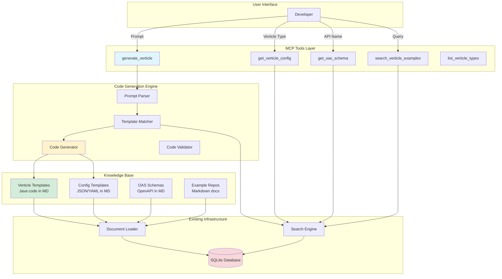

# Vert.x Code Generation Extension - Architecture Design

## Overview

This document outlines the architecture for extending the Fast MCP Local server to become a **Vert.x Development Assistant** that can generate verticle code, configurations, and OAS schemas based on user prompts.

## Goals

1. **Code Generation**: Generate Vert.x verticle classes from natural language prompts
2. **Configuration Templates**: Provide verticle-specific configuration examples
3. **OAS Schema Support**: Include OpenAPI schema templates for HTTP verticles
4. **Knowledge Base**: Maintain Vert.x best practices and examples in documentation
5. **Extensibility**: Easy to add new verticle types and patterns

## Use Cases

### Use Case 1: Generate PostgreSQL Verticle
```
User: "generate postgresdb verticle"
System: Returns PostgreSQL verticle class with:
- Complete verticle implementation
- Configuration template
- Example usage
```

### Use Case 2: Generate HTTP Verticle with OAS
```
User: "create http verticle for user management API"
System: Returns:
- HTTP verticle implementation
- Route handlers
- Configuration template
- OpenAPI schema for user endpoints
```

### Use Case 3: Search Similar Examples
```
User: "show me examples of message bus verticles"
System: Returns:
- Relevant documentation snippets
- Example implementations
- Configuration patterns
```

## Architecture Components



## Document Organization Strategy

### Proposed Structure

```
docs/
├── vertx/
│   ├── README.md                           # Overview and getting started
│   │
│   ├── verticles/
│   │   ├── _template-guide.md             # How to create templates
│   │   ├── base-verticle.md               # Base verticle pattern
│   │   ├── http-verticle.md               # HTTP server verticle
│   │   ├── postgres-verticle.md           # PostgreSQL client verticle
│   │   ├── redis-verticle.md              # Redis client verticle
│   │   ├── kafka-consumer-verticle.md     # Kafka consumer
│   │   ├── kafka-producer-verticle.md     # Kafka producer
│   │   └── eventbus-verticle.md           # Event bus patterns
│   │
│   ├── configurations/
│   │   ├── config-structure.md            # Config file structure
│   │   ├── http-server-config.md          # HTTP server config
│   │   ├── postgres-config.md             # PostgreSQL config
│   │   ├── redis-config.md                # Redis config
│   │   ├── kafka-config.md                # Kafka config
│   │   └── deployment-config.md           # Deployment options
│   │
│   ├── schemas/
│   │   ├── openapi-basics.md              # OpenAPI 3.0 basics
│   │   ├── user-api-schema.md             # Example: User management
│   │   ├── product-api-schema.md          # Example: Product catalog
│   │   └── schema-generation-guide.md     # How to generate schemas
│   │
│   ├── patterns/
│   │   ├── service-discovery.md           # Service discovery patterns
│   │   ├── circuit-breaker.md             # Circuit breaker implementation
│   │   ├── retry-logic.md                 # Retry patterns
│   │   └── health-checks.md               # Health check endpoints
│   │
│   └── examples/
│       ├── simple-rest-api.md             # Complete REST API example
│       ├── microservices-setup.md         # Multi-verticle app
│       └── database-integration.md        # Database patterns
```

### Document Format Standard

Each verticle template document should follow this structure:

```markdown
# Verticle Name

## Description
Brief description of what this verticle does.

## Use Cases
- Use case 1
- Use case 2

## Dependencies
```xml
<dependency>
    <groupId>io.vertx</groupId>
    <artifactId>vertx-pg-client</artifactId>
</dependency>
```

## Verticle Implementation
```java
package com.example.verticles;

import io.vertx.core.AbstractVerticle;
import io.vertx.core.Promise;

public class PostgresVerticle extends AbstractVerticle {
    @Override
    public void start(Promise<Void> startPromise) {
        // Implementation
    }
}
```

## Configuration Template
```json
{
  "postgres": {
    "host": "localhost",
    "port": 5432,
    "database": "mydb"
  }
}
```

## Deployment Example
```java
vertx.deployVerticle(new PostgresVerticle(), new DeploymentOptions()
    .setConfig(config));
```

## OAS Schema (if HTTP verticle)
```yaml
openapi: 3.0.0
info:
  title: API
  version: 1.0.0
```
```

## New MCP Tools

### 1. generate_verticle

**Purpose:** Generate a complete verticle implementation based on a prompt

**Signature:**
```python
def generate_verticle(
    prompt: str,
    verticle_type: str = "auto",
    include_config: bool = True,
    include_deployment: bool = True
) -> str
```

**Parameters:**
- `prompt`: Natural language description (e.g., "PostgreSQL verticle for user database")
- `verticle_type`: Type hint ("postgres", "http", "redis", "kafka", "auto")
- `include_config`: Include configuration template
- `include_deployment`: Include deployment example

**Returns:**
```json
{
  "verticle_class": "Java code...",
  "config_template": { },
  "deployment_example": "Java code...",
  "dependencies": ["vertx-pg-client"],
  "related_docs": ["postgres-verticle.md"]
}
```

**Logic:**
1. Parse prompt to identify verticle type (if auto)
2. Search docs for matching template
3. Extract code blocks from markdown
4. Optionally customize based on prompt details
5. Return structured response

### 2. get_verticle_config

**Purpose:** Get configuration template for a specific verticle type

**Signature:**
```python
def get_verticle_config(verticle_type: str, format: str = "json") -> str
```

**Parameters:**
- `verticle_type`: Type of verticle ("postgres", "http", "redis", etc.)
- `format`: Output format ("json", "yaml", "hocon")

**Returns:** Configuration template in requested format

### 3. get_oas_schema

**Purpose:** Get OpenAPI schema template for HTTP verticles

**Signature:**
```python
def get_oas_schema(api_name: str, operations: list = None) -> str
```

**Parameters:**
- `api_name`: Name of the API (e.g., "user-management", "product-catalog")
- `operations`: List of operations to include (optional)

**Returns:** OpenAPI 3.0 schema

### 4. search_verticle_examples

**Purpose:** Search for verticle examples and patterns

**Signature:**
```python
def search_verticle_examples(query: str, category: str = "all") -> str
```

**Parameters:**
- `query`: Search query
- `category`: Filter by category ("verticles", "configs", "schemas", "patterns", "all")

**Returns:** Matching examples with code snippets

### 5. list_verticle_types

**Purpose:** List all available verticle types with descriptions

**Signature:**
```python
def list_verticle_types() -> str
```

**Returns:**
```json
[
  {
    "type": "postgres",
    "name": "PostgreSQL Verticle",
    "description": "Database client verticle for PostgreSQL",
    "template_path": "vertx/verticles/postgres-verticle.md"
  }
]
```

## Code Generation Engine

### Component: Prompt Parser

**Responsibilities:**
- Parse natural language prompts
- Extract verticle type, database name, API endpoints, etc.
- Normalize to structured parameters

**Example:**
```
Input: "create a postgres verticle for user database with connection pooling"
Output: {
  "type": "postgres",
  "database": "user",
  "features": ["connection_pooling"]
}
```

### Component: Template Matcher

**Responsibilities:**
- Match parsed prompt to template documents
- Rank templates by relevance
- Support fuzzy matching

**Logic:**
- Search for verticle type in document titles
- Search for keywords in document content
- Rank by relevance score
- Return best match

### Component: Code Generator

**Responsibilities:**
- Extract code blocks from markdown documents
- Replace placeholders with user-specific values
- Generate customized code

**Placeholder Strategy:**
```java
// In template:
public class {{VERTICLE_NAME}}Verticle extends AbstractVerticle {
    private static final String DB_NAME = "{{DATABASE_NAME}}";
}

// After generation:
public class UserVerticle extends AbstractVerticle {
    private static final String DB_NAME = "user";
}
```

### Component: Code Validator

**Responsibilities:**
- Basic syntax validation
- Check for required imports
- Verify structure

**Optional Enhancements:**
- Compile check (if Java compiler available)
- Static analysis
- Style checking

## Database Schema Extension

### Option 1: Add Metadata Columns
```sql
ALTER TABLE documents ADD COLUMN category TEXT;
ALTER TABLE documents ADD COLUMN doc_type TEXT; -- 'template', 'example', 'guide'
ALTER TABLE documents ADD COLUMN verticle_type TEXT; -- 'postgres', 'http', etc.
```

### Option 2: Create Separate Table (Recommended)
```sql
CREATE TABLE verticle_templates (
    id INTEGER PRIMARY KEY,
    document_id INTEGER REFERENCES documents(id),
    verticle_type TEXT NOT NULL,
    category TEXT, -- 'verticle', 'config', 'schema'
    has_code_block BOOLEAN,
    has_config BOOLEAN,
    has_schema BOOLEAN,
    metadata JSON
);
```

### Option 3: Use Filename Convention (Current Approach)
- Store in categorized folders
- Parse folder structure from `filename` field
- Example: `vertx/verticles/postgres-verticle.md`
- Pros: Simple, no schema changes
- Cons: Less queryable

**Recommendation:** Start with Option 3, migrate to Option 2 if needed

## Implementation Phases

### Phase 1: Foundation (Week 1)
- [ ] Create Vert.x documentation structure
- [ ] Add 3-5 verticle templates (HTTP, PostgreSQL, Redis)
- [ ] Add configuration templates
- [ ] Add 1-2 OAS schema examples
- [ ] Test document loading and search

### Phase 2: Basic Code Generation (Week 1-2)
- [ ] Implement `list_verticle_types` tool
- [ ] Implement `search_verticle_examples` tool
- [ ] Create template extraction module
- [ ] Implement basic `generate_verticle` (template-only)
- [ ] Add unit tests

### Phase 3: Enhanced Generation (Week 2-3)
- [ ] Implement prompt parser
- [ ] Add placeholder replacement
- [ ] Implement `get_verticle_config` tool
- [ ] Implement `get_oas_schema` tool
- [ ] Add validation logic

### Phase 4: Advanced Features (Week 3-4)
- [ ] Add smart prompt understanding
- [ ] Implement code customization based on prompt
- [ ] Add example repository integration
- [ ] Create comprehensive test suite
- [ ] Documentation and examples

## Technology Stack

### Core Technologies
- **Python 3.10+**: Server implementation
- **FastMCP**: MCP protocol
- **SQLite**: Document storage
- **Tiktoken**: Token counting

### New Dependencies
```python
# For code parsing and manipulation
regex>=2023.0.0          # Advanced pattern matching
jinja2>=3.1.0           # Template engine (optional)
pyyaml>=6.0             # YAML parsing for configs
```

### Optional Enhancements
```python
# For LLM integration (future)
anthropic>=0.7.0        # Claude API
openai>=1.0.0           # OpenAI API

# For Java code validation (future)
javalang>=0.13.0        # Java parsing
```

## Security Considerations

### Input Validation
- Sanitize user prompts
- Limit verticle name length
- Validate verticle types against whitelist
- Prevent code injection in templates

### Code Generation Safety
- Never execute generated code
- Sandbox template rendering
- Validate all placeholders
- Escape special characters

### Template Security
- Review all templates before adding
- No executable code in markdown
- No external resource loading
- Read-only access to templates

## Performance Considerations

### Caching Strategy
```python
# Cache compiled templates
template_cache = {}

# Cache verticle type list
verticle_types_cache = None
cache_ttl = 3600  # 1 hour
```

### Optimization
- Index documents by category
- Pre-extract code blocks on load
- Lazy load large templates
- Batch similar requests

## Monitoring and Observability

### Metrics to Track
- Template usage frequency
- Generation success rate
- Search query patterns
- Response time per tool
- Document relevance scores

### Logging
```python
import logging

logger.info("Generating verticle", extra={
    "prompt": prompt,
    "verticle_type": verticle_type,
    "template_used": template_path,
    "duration_ms": duration
})
```

## Testing Strategy

### Unit Tests
- Template extraction
- Prompt parsing
- Code generation
- Placeholder replacement
- Configuration formatting

### Integration Tests
- End-to-end verticle generation
- Multi-step workflows
- Document search accuracy
- Error handling

### Test Data
- Sample verticle templates
- Example prompts with expected outputs
- Edge cases (invalid prompts, missing templates)

## Future Enhancements

### Short Term (1-3 months)
1. **LLM Integration**: Use Claude/GPT for smart code generation
2. **Multi-language Support**: Support Kotlin, Groovy verticles
3. **Project Scaffolding**: Generate complete Vert.x projects
4. **Dependency Management**: Auto-generate pom.xml/build.gradle

### Medium Term (3-6 months)
1. **Interactive Mode**: Chat-based verticle refinement
2. **Code Explanation**: Explain generated code
3. **Migration Tools**: Convert between verticle patterns
4. **Testing Support**: Generate unit tests for verticles

### Long Term (6-12 months)
1. **Custom Template Upload**: Users add their own templates
2. **Team Knowledge Base**: Share templates across team
3. **Version Control Integration**: Track template changes
4. **AI-Powered Optimization**: Suggest improvements to verticles

## Example Workflow

### Complete Example: PostgreSQL Verticle Generation

**Step 1: User Request**
```
User: "I need a PostgreSQL verticle for managing user accounts with connection pooling"
```

**Step 2: Tool Invocation**
```python
generate_verticle(
    prompt="PostgreSQL verticle for managing user accounts with connection pooling",
    verticle_type="auto",
    include_config=True,
    include_deployment=True
)
```

**Step 3: Internal Processing**
1. Prompt Parser extracts: `type=postgres, domain=user_accounts, features=[connection_pooling]`
2. Template Matcher finds: `vertx/verticles/postgres-verticle.md`
3. Code Generator extracts Java code, replaces placeholders
4. Config Generator creates customized config

**Step 4: Response**
```json
{
  "verticle_class": "package com.example.verticles;\n\nimport io.vertx.core.AbstractVerticle;...",
  "config_template": {
    "postgres": {
      "host": "localhost",
      "port": 5432,
      "database": "users",
      "pool": {
        "maxSize": 10
      }
    }
  },
  "deployment_example": "DeploymentOptions options = new DeploymentOptions()...",
  "dependencies": [
    "io.vertx:vertx-pg-client:4.5.0"
  ],
  "related_docs": [
    "vertx/verticles/postgres-verticle.md",
    "vertx/configurations/postgres-config.md"
  ]
}
```

## Migration Path

### From Current System
1. Keep existing document management intact
2. Add Vert.x docs to `docs/vertx/` folder
3. Implement new tools alongside existing ones
4. No breaking changes to current functionality

### Backward Compatibility
- Existing `search_documents` still works
- All current tools remain functional
- New tools are additive, not replacements

## Success Metrics

### Quantitative
- 90%+ template match accuracy
- <500ms generation time
- 10+ verticle types supported
- 100% test coverage for core features

### Qualitative
- Easy to add new templates
- Clear, well-documented generated code
- Helpful configuration examples
- Accurate OAS schemas

## Conclusion

This architecture provides a solid foundation for transforming the Fast MCP Local server into a powerful Vert.x development assistant. The phased approach ensures:

1. **Quick Wins**: Phase 1-2 deliver value immediately
2. **Scalability**: Design supports growth to advanced features
3. **Maintainability**: Clear separation of concerns
4. **Extensibility**: Easy to add new verticle types and patterns

The template-based approach with optional LLM enhancement offers the best balance of:
- **Reliability**: Predictable, tested templates
- **Flexibility**: Smart prompt understanding
- **Performance**: Fast response times
- **Safety**: Controlled code generation

Next steps: Review this architecture, then proceed with implementation starting with Phase 1.
