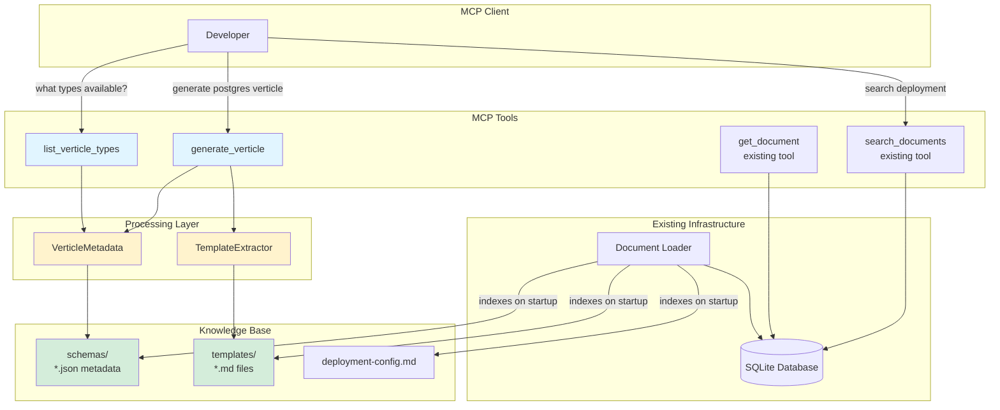
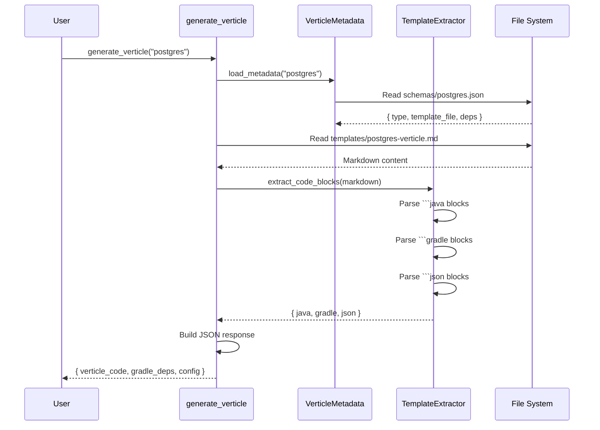

# Vert.x Code Generation - Simplified Architecture

## Overview

A simplified, template-based approach to generate Vert.x verticle code without LLM integration. This extension adds the ability to generate verticle classes, configurations, and schemas by extracting content from curated markdown templates.

## Key Constraints

- ✅ **No LLM**: Pure template extraction, no AI/ML dependencies
- ✅ **Gradle**: All dependency examples use Gradle (not Maven)
- ✅ **Simple**: Only template.md files, deployment-config.md, and schemas metadata
- ✅ **No External Scraping**: Use curated templates instead of scraping example repos

## Why Not Scrape Example Repos?

**Evaluated Approach**: Scraping external example repositories and feeding to context

**Problems Identified**:
1. **Context Pollution**: Repos contain irrelevant code (tests, build files, etc.)
2. **Version Drift**: External repos may use outdated Vert.x versions
3. **Inconsistency**: Different coding styles across repos
4. **Performance**: Large context size impacts response time
5. **Maintenance**: No control over external repo changes

**Better Approach**:
- Maintain curated, focused templates in docs/vertx/templates/
- Each template contains exactly what's needed: code + config + metadata
- Full control over quality, consistency, and versioning
- Smaller context size, faster responses

## Document Structure

```
docs/
└── vertx/
    ├── README.md                           # Getting started guide
    │
    ├── templates/
    │   ├── postgres-verticle.md            # PostgreSQL verticle template
    │   ├── http-verticle.md                # HTTP server verticle template
    │   ├── redis-verticle.md               # Redis client verticle template
    │   └── kafka-consumer-verticle.md      # Kafka consumer verticle template
    │
    ├── deployment-config.md                # Common deployment configurations
    │
    └── schemas/
        ├── postgres.json                   # PostgreSQL verticle metadata
        ├── http.json                       # HTTP verticle metadata
        ├── redis.json                      # Redis verticle metadata
        └── kafka-consumer.json             # Kafka consumer metadata
```

## Template Format (template.md)

Each template markdown file follows this structure:

```markdown
# PostgreSQL Verticle Template

## Description
A verticle for PostgreSQL database operations using Vert.x PostgreSQL client.

## Gradle Dependencies
```gradle
dependencies {
    implementation 'io.vertx:vertx-core:4.5.0'
    implementation 'io.vertx:vertx-pg-client:4.5.0'
}
```

## Verticle Code
```java
package com.example.verticles;

import io.vertx.core.AbstractVerticle;
import io.vertx.core.Promise;
import io.vertx.pgclient.PgConnectOptions;
import io.vertx.pgclient.PgPool;
import io.vertx.sqlclient.PoolOptions;

public class PostgresVerticle extends AbstractVerticle {

    private PgPool client;

    @Override
    public void start(Promise<Void> startPromise) {
        PgConnectOptions connectOptions = new PgConnectOptions()
            .setPort(config().getInteger("postgres.port", 5432))
            .setHost(config().getString("postgres.host", "localhost"))
            .setDatabase(config().getString("postgres.database", "mydb"))
            .setUser(config().getString("postgres.user", "user"))
            .setPassword(config().getString("postgres.password", "password"));

        PoolOptions poolOptions = new PoolOptions()
            .setMaxSize(config().getInteger("postgres.poolSize", 5));

        client = PgPool.pool(vertx, connectOptions, poolOptions);

        startPromise.complete();
    }

    @Override
    public void stop(Promise<Void> stopPromise) {
        if (client != null) {
            client.close();
        }
        stopPromise.complete();
    }
}
```

## Configuration Example
```json
{
  "postgres": {
    "host": "localhost",
    "port": 5432,
    "database": "mydb",
    "user": "dbuser",
    "password": "dbpass",
    "poolSize": 10
  }
}
```

## Deployment Example
```java
JsonObject config = new JsonObject()
    .put("postgres", new JsonObject()
        .put("host", "localhost")
        .put("port", 5432)
        .put("database", "users"));

DeploymentOptions options = new DeploymentOptions()
    .setConfig(config)
    .setInstances(1);

vertx.deployVerticle(new PostgresVerticle(), options, res -> {
    if (res.succeeded()) {
        System.out.println("Verticle deployed: " + res.result());
    } else {
        System.err.println("Deployment failed: " + res.cause());
    }
});
```
```

## Metadata Format (schemas/*.json)

Each JSON file in schemas/ contains metadata about a verticle type:

```json
{
  "type": "postgres",
  "name": "PostgreSQL Verticle",
  "description": "Database client verticle for PostgreSQL operations",
  "template_file": "templates/postgres-verticle.md",
  "gradle_dependencies": [
    "io.vertx:vertx-core:4.5.0",
    "io.vertx:vertx-pg-client:4.5.0"
  ],
  "config_keys": [
    "postgres.host",
    "postgres.port",
    "postgres.database",
    "postgres.user",
    "postgres.password",
    "postgres.poolSize"
  ],
  "use_cases": [
    "CRUD operations on PostgreSQL database",
    "Connection pooling for high-performance apps",
    "Reactive database queries"
  ]
}
```

## Deployment Config Format (deployment-config.md)

Common deployment configurations and patterns:

```markdown
# Vert.x Deployment Configurations

## Standard Deployment Options

### Single Instance
```java
DeploymentOptions options = new DeploymentOptions()
    .setConfig(config)
    .setInstances(1);
```

### Worker Pool Deployment
```java
DeploymentOptions options = new DeploymentOptions()
    .setConfig(config)
    .setWorker(true)
    .setWorkerPoolSize(10);
```

### High Availability (HA)
```java
DeploymentOptions options = new DeploymentOptions()
    .setConfig(config)
    .setHa(true);
```

## Configuration Sources

### JSON File
```java
vertx.fileSystem().readFile("config.json", res -> {
    if (res.succeeded()) {
        JsonObject config = res.result().toJsonObject();
        vertx.deployVerticle(new MyVerticle(),
            new DeploymentOptions().setConfig(config));
    }
});
```

### Environment Variables
```java
JsonObject config = new JsonObject()
    .put("postgres.host", System.getenv("DB_HOST"))
    .put("postgres.port", Integer.parseInt(System.getenv("DB_PORT")));
```
```

## Simplified MCP Tools

Only **2 new tools** added:

### 1. generate_verticle

**Purpose**: Generate verticle code from template

**Signature**:
```python
def generate_verticle(verticle_type: str) -> str
```

**Parameters**:
- `verticle_type`: Type of verticle (e.g., "postgres", "http", "redis", "kafka-consumer")

**Returns**: JSON string with:
```json
{
  "type": "postgres",
  "name": "PostgreSQL Verticle",
  "verticle_code": "package com.example.verticles;\n\nimport...",
  "gradle_dependencies": [
    "implementation 'io.vertx:vertx-pg-client:4.5.0'"
  ],
  "config_example": {
    "postgres": {
      "host": "localhost",
      "port": 5432
    }
  },
  "deployment_example": "DeploymentOptions options = new DeploymentOptions()..."
}
```

**Logic**:
1. Look up metadata in `schemas/{verticle_type}.json`
2. Read template file specified in metadata
3. Extract code blocks by markdown fence type (```java, ```json, ```gradle)
4. Return structured JSON response

### 2. list_verticle_types

**Purpose**: List all available verticle templates

**Signature**:
```python
def list_verticle_types() -> str
```

**Returns**: JSON array of available types:
```json
[
  {
    "type": "postgres",
    "name": "PostgreSQL Verticle",
    "description": "Database client verticle for PostgreSQL operations",
    "gradle_deps": ["io.vertx:vertx-pg-client:4.5.0"]
  },
  {
    "type": "http",
    "name": "HTTP Server Verticle",
    "description": "REST API server with Vert.x Web",
    "gradle_deps": ["io.vertx:vertx-web:4.5.0"]
  }
]
```

**Logic**:
1. Scan `docs/vertx/schemas/` directory
2. Read all `.json` files
3. Return aggregated list

**Bonus**: Existing `search_documents` and `get_document` tools already work for finding deployment configs and searching templates!

## Implementation Design

### Code Extraction Module

```python
# src/fast_mcp_local/template_extractor.py

import re
from pathlib import Path
from typing import Dict, Optional

class TemplateExtractor:
    """Extract code blocks and content from markdown templates."""

    def extract_code_blocks(self, markdown: str) -> Dict[str, str]:
        """Extract all fenced code blocks by language.

        Returns:
            {
                'java': 'class PostgresVerticle...',
                'gradle': 'dependencies {...}',
                'json': '{"postgres": {...}}',
                'deployment': 'DeploymentOptions...'
            }
        """
        blocks = {}
        pattern = r'```(\w+)\n(.*?)```'
        matches = re.findall(pattern, markdown, re.DOTALL)

        for lang, code in matches:
            if lang in ['java', 'gradle', 'json']:
                blocks[lang] = code.strip()
            # Deployment examples are Java code under ## Deployment
            elif lang == 'java' and '## Deployment' in markdown:
                blocks['deployment'] = code.strip()

        return blocks

    def extract_description(self, markdown: str) -> str:
        """Extract description from ## Description section."""
        match = re.search(r'## Description\n(.*?)\n\n', markdown, re.DOTALL)
        return match.group(1).strip() if match else ""
```

### Metadata Loader Module

```python
# src/fast_mcp_local/metadata.py

import json
from pathlib import Path
from typing import Dict, List, Optional

class VerticleMetadata:
    """Load and manage verticle metadata from schemas folder."""

    def __init__(self, schemas_path: Path):
        self.schemas_path = schemas_path
        self._cache: Dict[str, dict] = {}

    def load_metadata(self, verticle_type: str) -> Optional[dict]:
        """Load metadata for a specific verticle type."""
        if verticle_type in self._cache:
            return self._cache[verticle_type]

        schema_file = self.schemas_path / f"{verticle_type}.json"
        if not schema_file.exists():
            return None

        with open(schema_file, 'r') as f:
            metadata = json.load(f)
            self._cache[verticle_type] = metadata
            return metadata

    def list_all_types(self) -> List[dict]:
        """List all available verticle types."""
        types = []
        for schema_file in self.schemas_path.glob("*.json"):
            with open(schema_file, 'r') as f:
                metadata = json.load(f)
                types.append({
                    "type": metadata["type"],
                    "name": metadata["name"],
                    "description": metadata["description"],
                    "gradle_deps": metadata["gradle_dependencies"]
                })
        return types
```

### Updated Server Module

```python
# src/fast_mcp_local/server.py (additions)

from .template_extractor import TemplateExtractor
from .metadata import VerticleMetadata

# Initialize verticle components
base_path = Path(__file__).parent.parent.parent
vertx_schemas_path = base_path / "docs" / "vertx" / "schemas"
vertx_templates_path = base_path / "docs" / "vertx" / "templates"

metadata_loader = VerticleMetadata(vertx_schemas_path)
template_extractor = TemplateExtractor()


def generate_verticle(verticle_type: str) -> str:
    """Generate a verticle from template.

    Args:
        verticle_type: Type of verticle (e.g., 'postgres', 'http', 'redis')

    Returns:
        JSON string with verticle code, config, and deployment example
    """
    # Load metadata
    metadata = metadata_loader.load_metadata(verticle_type)
    if not metadata:
        return json.dumps({
            "error": f"Unknown verticle type: {verticle_type}",
            "available_types": metadata_loader.list_all_types()
        })

    # Read template file
    template_file = base_path / "docs" / "vertx" / metadata["template_file"]
    if not template_file.exists():
        return json.dumps({"error": f"Template file not found: {template_file}"})

    template_content = template_file.read_text()

    # Extract code blocks
    code_blocks = template_extractor.extract_code_blocks(template_content)

    # Build response
    result = {
        "type": metadata["type"],
        "name": metadata["name"],
        "description": metadata["description"],
        "verticle_code": code_blocks.get("java", ""),
        "gradle_dependencies": metadata["gradle_dependencies"],
        "config_example": json.loads(code_blocks.get("json", "{}")),
        "deployment_example": code_blocks.get("deployment", "")
    }

    return json.dumps(result, indent=2)


def list_verticle_types() -> str:
    """List all available verticle types.

    Returns:
        JSON array of verticle types with metadata
    """
    types = metadata_loader.list_all_types()
    return json.dumps(types, indent=2)


# Register new tools
mcp.tool()(generate_verticle)
mcp.tool()(list_verticle_types)
```

## Architecture Diagram



## Flow Example: Generate PostgreSQL Verticle



## Initial Templates to Create

Start with 4 common verticle types:

1. **postgres-verticle.md** - PostgreSQL database client
2. **http-verticle.md** - HTTP REST API server
3. **redis-verticle.md** - Redis cache client
4. **kafka-consumer-verticle.md** - Kafka message consumer

Each with corresponding JSON metadata in schemas/.

## Testing Strategy

### Unit Tests

```python
# tests/test_template_extractor.py
def test_extract_java_code():
    markdown = "```java\nclass Test {}\n```"
    extractor = TemplateExtractor()
    blocks = extractor.extract_code_blocks(markdown)
    assert "java" in blocks
    assert "class Test" in blocks["java"]

# tests/test_metadata.py
def test_load_postgres_metadata():
    metadata = VerticleMetadata(schemas_path)
    postgres = metadata.load_metadata("postgres")
    assert postgres["type"] == "postgres"
    assert "vertx-pg-client" in str(postgres["gradle_dependencies"])

# tests/test_verticle_tools.py
def test_generate_postgres_verticle():
    result = generate_verticle("postgres")
    data = json.loads(result)
    assert "verticle_code" in data
    assert "PostgresVerticle" in data["verticle_code"]
    assert "gradle_dependencies" in data
```

## Implementation Phases

### Phase 1: Foundation (2-3 hours)
- [x] Create document structure (docs/vertx/)
- [ ] Write postgres-verticle.md template
- [ ] Write http-verticle.md template
- [ ] Create schemas/postgres.json metadata
- [ ] Create schemas/http.json metadata
- [ ] Write deployment-config.md

### Phase 2: Code (2-3 hours)
- [ ] Implement TemplateExtractor class
- [ ] Implement VerticleMetadata class
- [ ] Add generate_verticle tool to server.py
- [ ] Add list_verticle_types tool to server.py
- [ ] Write unit tests (target: 15 tests)

### Phase 3: Testing & Docs (1-2 hours)
- [ ] Test with MCP Inspector
- [ ] Add remaining templates (redis, kafka)
- [ ] Update README.md with new tools
- [ ] Update ARCHITECTURE.md (if needed)

## Advantages of This Approach

1. **Simple**: No LLM, no complex prompt parsing, just template extraction
2. **Fast**: Direct file reads and regex parsing (< 50ms response time)
3. **Maintainable**: Templates are markdown files that can be easily updated
4. **Gradle Native**: All examples use Gradle, not Maven
5. **Reuses Existing**: Leverages existing document loader and search
6. **Type Safe**: Metadata schema enforces structure
7. **Extensible**: Easy to add new verticle types (just add .md + .json)

## Limitations & Future Enhancements

**Current Limitations**:
- No customization based on user prompt (e.g., "with connection pooling")
- No validation of generated code
- Fixed templates only

**Future Enhancements** (if needed):
- Simple placeholder replacement (e.g., `{{CLASS_NAME}}` → `UserVerticle`)
- Combine multiple templates (e.g., HTTP + PostgreSQL)
- Add validation using regex patterns
- Support for Kotlin verticles (separate templates)

## Success Metrics

- ✅ Can generate 4 verticle types (postgres, http, redis, kafka)
- ✅ All dependencies shown in Gradle format
- ✅ Response time < 100ms
- ✅ 100% test coverage for extractor and metadata modules
- ✅ All existing tests still pass (26 tests)
- ✅ No external dependencies (no LLM APIs)

## Conclusion

This simplified approach delivers:
- **Immediate Value**: Generate working verticle code from templates
- **Zero External Deps**: No LLM, no API calls, no network requests
- **Gradle-First**: All build examples use Gradle
- **Low Maintenance**: Curated templates > scraped repos
- **Fast**: Direct file operations, no AI inference overhead

The template-based design is reliable, predictable, and easy to extend. Adding a new verticle type requires only:
1. Create `templates/{type}-verticle.md` with code examples
2. Create `schemas/{type}.json` with metadata
3. Reload server - done!

Ready to proceed with implementation.
