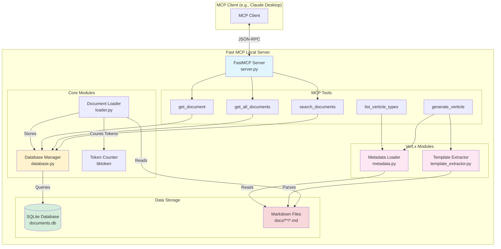
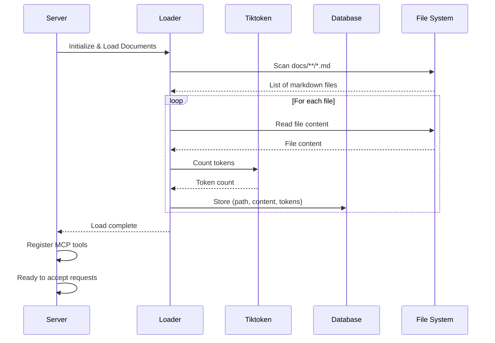
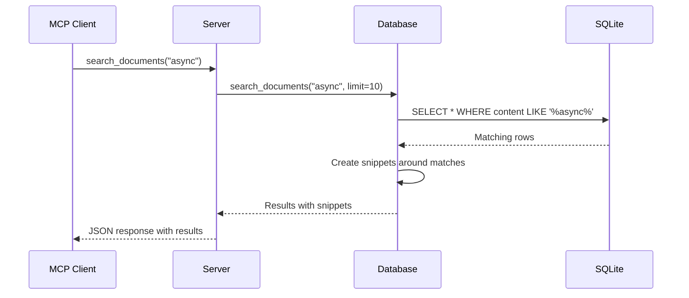
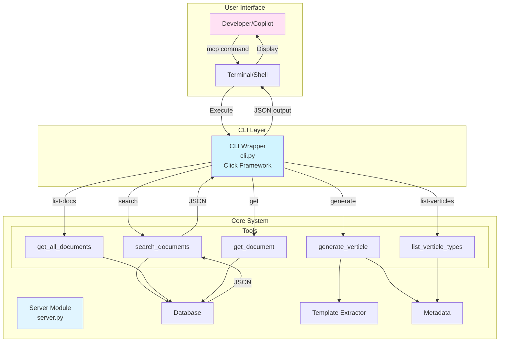
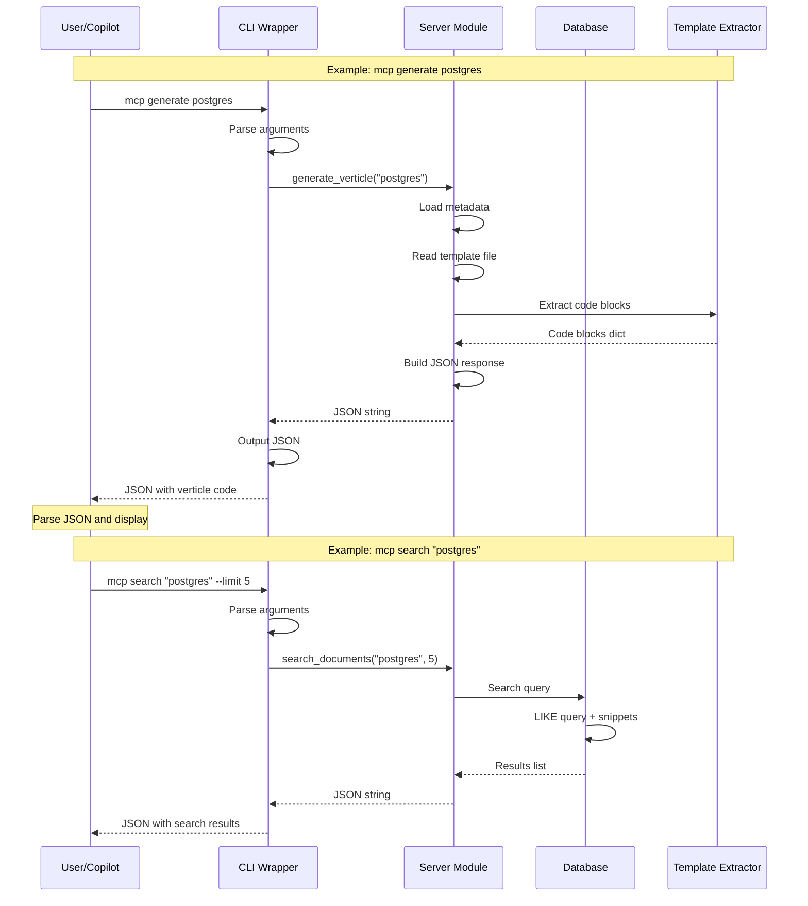
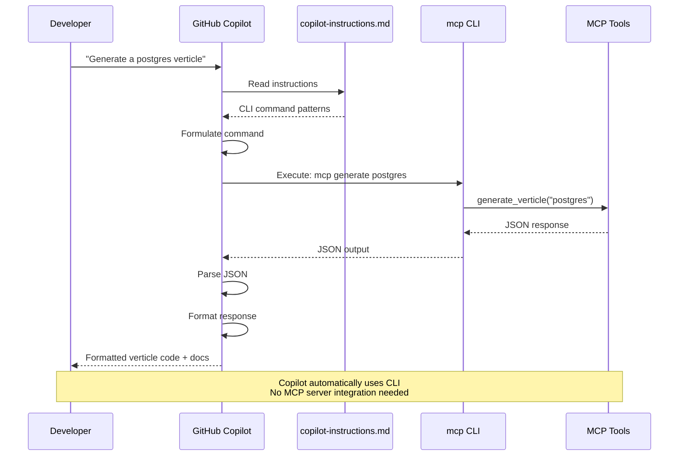
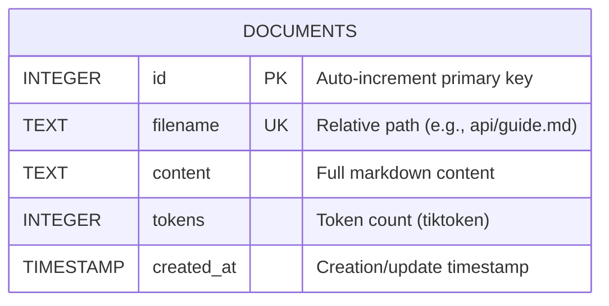

# Architecture Documentation

## Overview

Fast MCP Local is a Model Context Protocol (MCP) server that provides intelligent document management, querying capabilities, and Vert.x verticle code generation. It automatically indexes markdown documentation, stores it in SQLite with token counts, and exposes tools for searching, retrieving content, and generating Vert.x verticles from templates.

## System Architecture



## Data Flow

### Startup Flow



### Query Flow



## CLI Architecture

The CLI wrapper provides command-line access to all MCP tools, enabling integration with GitHub Copilot and other tools when direct MCP server integration is not available.

### CLI System Architecture



### CLI Invocation Flow



### GitHub Copilot Integration Flow



### CLI Commands Mapping

| CLI Command | Server Function | Description |
|------------|----------------|-------------|
| `mcp search <query>` | `search_documents()` | Search documents with contextual snippets |
| `mcp list-docs` | `get_all_documents()` | List all indexed documents |
| `mcp get <file>` | `get_document()` | Get full content of document |
| `mcp generate <type>` | `generate_verticle()` | Generate verticle code from template |
| `mcp list-verticles` | `list_verticle_types()` | List available verticle types |
| `mcp ask <question>` | `search_documents()` | Quick search (limit=5) |

## Component Details

### 1. Server Module (server.py)

**Responsibilities:**
- Initialize FastMCP server
- Load documents on startup
- Register MCP tools
- Handle tool invocations
- Manage database connection lifecycle

**Key Functions:**
```python
_initialize_database()     # Setup DB and load docs
search_documents()         # Search tool
get_all_documents()        # List tool
get_document()             # Retrieve tool
generate_verticle()        # Generate Vert.x verticle code
list_verticle_types()      # List available verticle templates
```

**Dependencies:**
- FastMCP framework
- Database module
- Loader module
- Template Extractor module
- Metadata module

### 2. Database Module (database.py)

**Responsibilities:**
- SQLite database operations
- Document CRUD operations
- Full-text search
- Context manager support

**Key Methods:**
```python
connect()                  # Establish connection
insert_document()          # Add new document
update_document()          # Update existing document
search_documents()         # Search with snippets
get_document_by_filename() # Retrieve by path
get_total_tokens()         # Aggregate token count
```

**Database Schema:**
```sql
CREATE TABLE documents (
    id INTEGER PRIMARY KEY AUTOINCREMENT,
    filename TEXT NOT NULL UNIQUE,
    content TEXT NOT NULL,
    tokens INTEGER NOT NULL,
    created_at TIMESTAMP DEFAULT CURRENT_TIMESTAMP
)
```

### 3. Loader Module (loader.py)

**Responsibilities:**
- Recursive file scanning
- Document loading
- Token counting
- Batch processing with statistics

**Key Methods:**
```python
load_all_documents()       # Scan and load all files
load_file()                # Load single file
count_tokens()             # Calculate token count
```

**Process:**
1. Scan `docs/` with `glob("**/*.md")`
2. Read each file's content
3. Calculate tokens using tiktoken
4. Store in database with relative path

### 4. Template Extractor Module (template_extractor.py)

**Responsibilities:**
- Parse markdown templates
- Extract fenced code blocks (Java, Gradle, JSON)
- Extract sections by heading
- Support multiple code block types

**Key Methods:**
```python
extract_code_blocks()      # Extract all code blocks by language
extract_description()      # Get description section
extract_section()          # Get arbitrary section content
```

**Process:**
1. Use regex to find fenced code blocks (```language)
2. Categorize by language (java, gradle, json)
3. Identify deployment examples vs verticle code
4. Return structured dictionary

### 5. Metadata Module (metadata.py)

**Responsibilities:**
- Load verticle metadata from JSON schemas
- Cache metadata for performance
- List all available verticle types
- Validate metadata structure

**Key Methods:**
```python
load_metadata()            # Load metadata for specific type
list_all_types()           # Get all available verticles
clear_cache()              # Clear metadata cache
```

**Metadata Schema (schemas/*.json):**
```json
{
  "type": "postgres",
  "name": "PostgreSQL Verticle",
  "description": "Database client verticle",
  "template_file": "templates/postgres-verticle.md",
  "gradle_dependencies": ["io.vertx:vertx-pg-client:4.5.0"],
  "config_keys": ["postgres.host", "postgres.port"],
  "use_cases": ["CRUD operations", "Connection pooling"]
}
```

### 6. CLI Module (cli.py)

**Responsibilities:**
- Command-line interface for all MCP tools
- Argument parsing and validation
- JSON output formatting
- Entry point for GitHub Copilot integration

**Key Commands:**
```python
search()              # Search documents
list_docs()           # List all documents
get()                 # Get document content
generate()            # Generate verticle code
list_verticles()      # List verticle types
ask()                 # Quick search alias
```

**Framework:** Click (Python CLI framework)

**Entry Point:**
```bash
# Installed as 'mcp' command via pyproject.toml
mcp search "postgres"
mcp generate http
```

**Design Principles:**
1. **JSON Output**: All commands return structured JSON for machine parsing
2. **Simple Interface**: Clear, intuitive command structure
3. **Error Handling**: Graceful error messages in JSON format
4. **Minimal Dependencies**: Only requires click library
5. **Direct Integration**: Calls server functions directly, no network overhead

**Use Cases:**
- **GitHub Copilot**: Copilot executes commands to answer questions
- **Shell Scripts**: Automate documentation queries
- **CI/CD**: Generate code in build pipelines
- **Development**: Quick access to docs and code generation

## Database Schema



**Indexes:**
- Primary Key: `id`
- Unique Constraint: `filename`

**Notes:**
- `filename` stores relative path from docs directory
- `content` indexed for LIKE queries
- `tokens` calculated using cl100k_base encoding (GPT-4)

## MCP Tools API

### search_documents

**Purpose:** Search documents by content with contextual snippets

**Signature:**
```python
def search_documents(query: str, limit: int = 10) -> str
```

**Returns:**
```json
[
  {
    "id": 1,
    "filename": "tutorials/guide.md",
    "snippet": "...context around match...",
    "tokens": 450,
    "created_at": "2025-01-01 12:00:00"
  }
]
```

### get_all_documents

**Purpose:** List all indexed documents

**Signature:**
```python
def get_all_documents() -> str
```

**Returns:**
```json
[
  {
    "id": 1,
    "filename": "guide.md",
    "tokens": 450,
    "created_at": "2025-01-01 12:00:00"
  }
]
```

### get_document

**Purpose:** Retrieve full content of a specific document

**Signature:**
```python
def get_document(filename: str) -> str
```

**Parameters:**
- `filename`: Relative path (e.g., "tutorials/guide.md")

**Returns:**
```json
{
  "id": 1,
  "filename": "tutorials/guide.md",
  "content": "# Full markdown content...",
  "tokens": 450,
  "created_at": "2025-01-01 12:00:00"
}
```

### generate_verticle

**Purpose:** Generate Vert.x verticle code from templates

**Signature:**
```python
def generate_verticle(verticle_type: str) -> str
```

**Parameters:**
- `verticle_type`: Type of verticle (e.g., "postgres", "http", "redis")

**Returns:**
```json
{
  "type": "postgres",
  "name": "PostgreSQL Verticle",
  "description": "Database client verticle...",
  "verticle_code": "package com.example.verticles;\n...",
  "gradle_dependencies": ["io.vertx:vertx-core:4.5.0", ...],
  "config_example": {"postgres": {"host": "localhost", ...}},
  "deployment_example": "DeploymentOptions options = ...",
  "use_cases": ["CRUD operations", ...]
}
```

**Process:**
1. Load metadata from `schemas/{verticle_type}.json`
2. Read template file specified in metadata
3. Extract code blocks using TemplateExtractor
4. Parse JSON configuration
5. Return structured response

### list_verticle_types

**Purpose:** List all available verticle templates

**Signature:**
```python
def list_verticle_types() -> str
```

**Returns:**
```json
[
  {
    "type": "postgres",
    "name": "PostgreSQL Verticle",
    "description": "Database client verticle...",
    "gradle_deps": ["io.vertx:vertx-pg-client:4.5.0"]
  },
  ...
]
```

## Token Counting

### Encoding: cl100k_base

Used by GPT-4, GPT-3.5-turbo

**Process:**
```python
import tiktoken

encoding = tiktoken.get_encoding("cl100k_base")
tokens = encoding.encode(text)
token_count = len(tokens)
```

**Why Token Counting?**
- LLMs have context window limits (e.g., 128k tokens for GPT-4)
- Helps estimate API costs
- Enables smart document chunking
- Useful for RAG applications

## Directory Structure

```
fast-mcp-local/
├── docs/                       # Source documents
│   ├── *.md                    # General documentation
│   └── vertx/                  # Vert.x templates
│       ├── README.md
│       ├── templates/          # Verticle code templates
│       │   ├── postgres-verticle.md
│       │   └── http-verticle.md
│       ├── schemas/            # Verticle metadata (JSON)
│       │   ├── postgres.json
│       │   └── http.json
│       └── deployment-config.md
│
├── src/fast_mcp_local/        # Source code
│   ├── __init__.py
│   ├── server.py              # Main server
│   ├── cli.py                 # CLI wrapper (NEW)
│   ├── database.py            # DB operations
│   ├── loader.py              # Document loader
│   ├── template_extractor.py  # Template parsing
│   └── metadata.py            # Verticle metadata
│
├── tests/                     # Test suite (69 tests)
│   ├── test_server.py
│   ├── test_cli.py            # CLI tests (NEW)
│   ├── test_database.py
│   ├── test_loader.py
│   ├── test_template_extractor.py
│   ├── test_metadata.py
│   └── test_verticle_tools.py
│
├── .github/
│   └── copilot-instructions.md  # Copilot integration (NEW)
│
├── documents.db              # SQLite database (gitignored)
├── ARCHITECTURE.md           # This file
├── ARCHITECTURE-VERTX-SIMPLE.md  # Vert.x extension design
└── README.md                 # User guide
```

## Design Decisions

### Why SQLite?

✅ **Pros:**
- Zero configuration
- Serverless
- ACID compliant
- Fast for read-heavy workloads
- Single file storage
- Excellent for < 1M documents

❌ **Cons:**
- Not suitable for high concurrency writes
- Limited to single machine

**Alternatives Considered:**
- PostgreSQL: Overkill for this use case
- Vector DB (Pinecone, Weaviate): Future enhancement for semantic search

### Why Relative Paths?

Storing relative paths (e.g., `tutorials/guide.md`) instead of just filenames:

✅ **Pros:**
- Supports nested folders
- Preserves directory structure
- No filename collisions
- Clearer organization

❌ **Cons:**
- Paths change if files move
- Slightly longer storage

**Solution:** Use relative paths with unique constraint

### Why Tiktoken?

Using OpenAI's tiktoken library:

✅ **Pros:**
- Accurate token counts for GPT models
- Fast (Rust implementation)
- Supports multiple encodings
- Official OpenAI library

❌ **Cons:**
- Adds dependency
- Specific to OpenAI models

**Alternatives:** Could use character count / 4 approximation

## Performance Considerations

### Current Implementation

- **Search:** O(n) linear scan with LIKE query
- **Retrieval:** O(1) with filename index
- **Loading:** O(n) where n = number of files

### Scalability

**Current Limits:**
- ~10,000 documents (tested with 7)
- ~1GB total content
- ~100 req/sec (limited by SQLite)

**Future Optimizations:**
- Add full-text search index (FTS5)
- Implement vector embeddings for semantic search
- Add caching layer (Redis)
- Batch operations for bulk loading

## Testing Strategy

### Test Coverage

- **Unit Tests:** 69 tests covering all modules
- **Database Tests:** 13 tests for CRUD operations
- **Loader Tests:** 12 tests for file operations
- **Server Tests:** 1 test for tool imports
- **Template Extractor Tests:** 13 tests for code extraction
- **Metadata Tests:** 10 tests for metadata loading
- **Verticle Tools Tests:** 7 tests for end-to-end generation
- **CLI Tests:** 15 tests for command-line interface

### Test Structure

```
tests/
├── test_database.py            # Database operations
├── test_loader.py              # Document loading
├── test_server.py              # Server tool imports
├── test_cli.py                 # CLI commands (NEW)
├── test_template_extractor.py  # Template parsing
├── test_metadata.py            # Metadata loading
└── test_verticle_tools.py      # Verticle generation
```

### Running Tests

```bash
pytest                     # All tests
pytest -v                  # Verbose
pytest tests/test_database.py  # Specific module
```

## Future Enhancements

### Planned Features

1. **Semantic Search**
   - Add vector embeddings (OpenAI embeddings)
   - Implement similarity search
   - Hybrid search (keyword + semantic)

2. **Advanced Indexing**
   - SQLite FTS5 for full-text search
   - Hierarchical document structure
   - Tag/category support

3. **Incremental Updates**
   - Watch filesystem for changes
   - Auto-reload on file modifications
   - Differential updates

4. **Export/Import**
   - Export database to JSON
   - Import from external sources
   - Backup/restore functionality

5. **Analytics**
   - Search query analytics
   - Popular documents tracking
   - Token usage trends

### Extension Points

The architecture is designed for extensibility:

- **Custom Loaders:** Support PDF, HTML, etc.
- **Multiple Databases:** PostgreSQL, MongoDB
- **Additional Tools:** Summarization, extraction
- **Custom Encodings:** Different tokenizers
- **New Verticle Types:** Add templates and metadata for new verticle types
- **Multi-language Support:** Extend to support Kotlin, Groovy verticles

## Deployment

### Local Development

```bash
python3 -m fast_mcp_local.server
```

### Production Considerations

1. **Database Backups**
   - Regular SQLite backups
   - Versioning strategy

2. **Monitoring**
   - Log aggregation
   - Performance metrics
   - Error tracking

3. **Security**
   - Input validation
   - SQL injection prevention (using parameterized queries)
   - File path validation

## Troubleshooting

### Common Issues

**Issue:** Database locked
- **Cause:** Multiple writers
- **Solution:** Use connection pooling or WAL mode

**Issue:** Token counts seem off
- **Cause:** Wrong encoding
- **Solution:** Verify using cl100k_base

**Issue:** Files not loading
- **Cause:** Invalid UTF-8
- **Solution:** Check file encoding, handle errors gracefully

## CLI and GitHub Copilot Integration

### Overview

The CLI wrapper enables access to all MCP tools from the command line, providing a workaround for organizations where MCP server integration is disabled. GitHub Copilot can execute these CLI commands to provide intelligent assistance.

### Key Features

- **No MCP Server Required**: Uses direct CLI commands instead of JSON-RPC
- **Copilot Compatible**: Copilot reads `.github/copilot-instructions.md` automatically
- **JSON Output**: All commands return structured JSON for machine parsing
- **Full Feature Parity**: All MCP tools accessible via CLI

### Usage Examples

```bash
# Search documentation
mcp search "postgres verticle" --limit 5

# Generate code
mcp generate postgres

# List available templates
mcp list-verticles

# Get specific document
mcp get "vertx/deployment-config.md"
```

### Copilot Workflow

1. Developer asks Copilot a question
2. Copilot reads copilot-instructions.md
3. Copilot determines appropriate CLI command
4. Copilot executes command and parses JSON
5. Copilot presents formatted response to developer

### Benefits

- **Bypasses Restrictions**: Works when MCP integration is blocked
- **No Configuration**: Copilot automatically discovers CLI capabilities
- **Fast**: Direct function calls, no network overhead
- **Reliable**: Same code path as MCP server

For detailed Copilot usage patterns, see [COPILOT-USAGE.md](COPILOT-USAGE.md).

## Vert.x Code Generation

For detailed information about the Vert.x verticle code generation feature, see:
- [ARCHITECTURE-VERTX-SIMPLE.md](ARCHITECTURE-VERTX-SIMPLE.md) - Detailed Vert.x extension design
- [docs/vertx/README.md](docs/vertx/README.md) - Verticle templates guide

**Key Features:**
- Template-based code generation (no LLM required)
- Gradle dependency management
- Support for PostgreSQL, HTTP verticles
- Easily extensible to new verticle types

## References

- [Model Context Protocol Specification](https://modelcontextprotocol.io)
- [FastMCP Documentation](https://github.com/jlowin/fastmcp)
- [Tiktoken Documentation](https://github.com/openai/tiktoken)
- [SQLite Documentation](https://sqlite.org/docs.html)
- [Vert.x Documentation](https://vertx.io/docs/)
