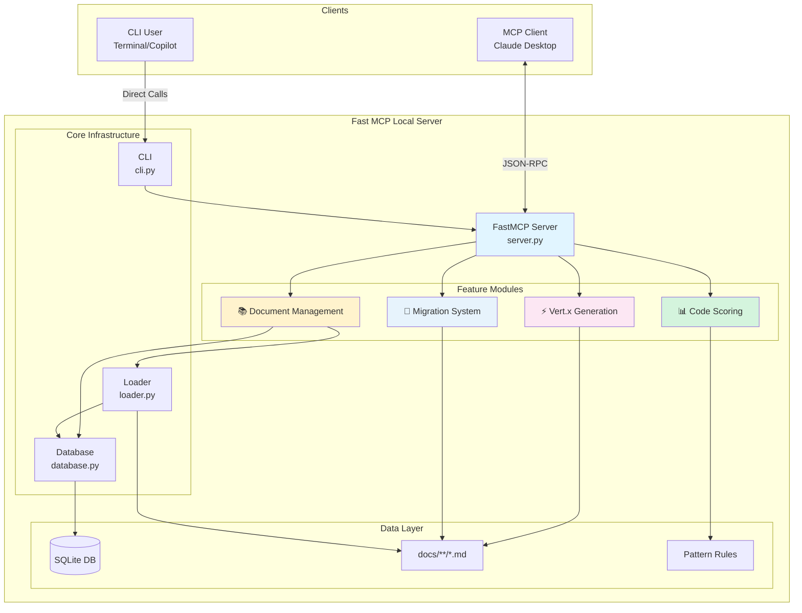
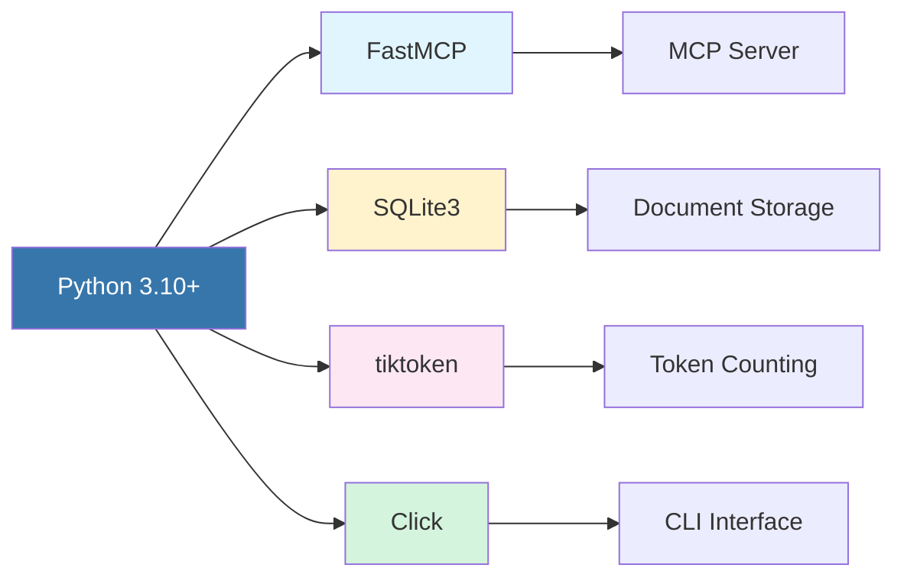
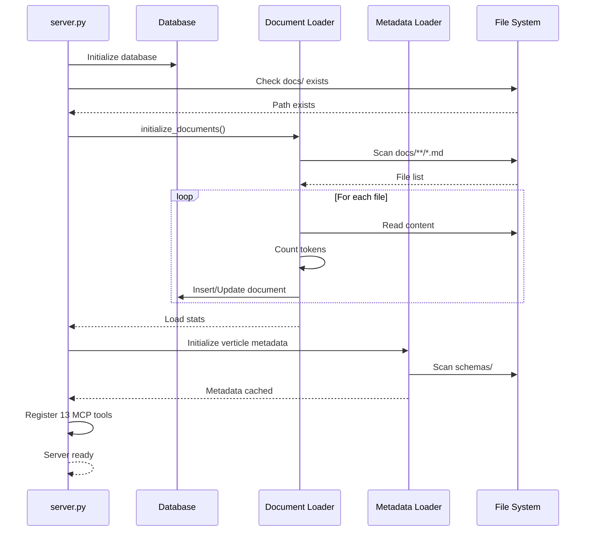
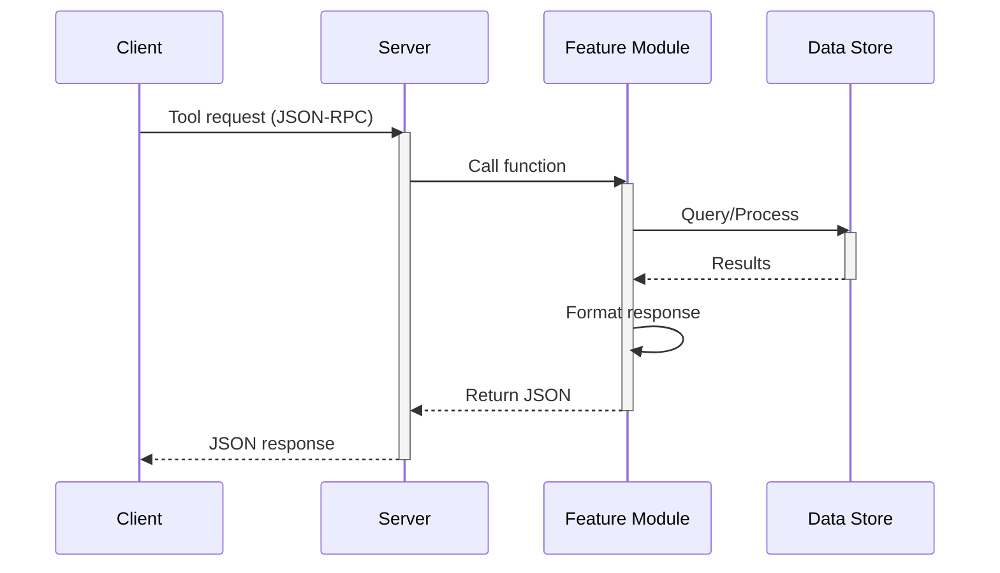

# Fast MCP Local - Architecture

> **Purpose**: High-level architecture overview and design documentation for Fast MCP Local

## Table of Contents

- [Overview](#overview)
- [System Architecture](#system-architecture)
- [Feature Modules](#feature-modules)
- [Technology Stack](#technology-stack)
- [Design Principles](#design-principles)
- [Detailed Design Docs](#detailed-design-docs)

---

## Overview

Fast MCP Local is a Model Context Protocol (MCP) server that provides four core capabilities:

1. **Document Management** - Intelligent markdown indexing with full-text search
2. **Vert.x Code Generation** - Template-based verticle code generation
3. **Migration System** - Step-by-step OpenRewrite migration guidance
4. **Code Scoring** - Rule-based codebase quality analysis

### Key Characteristics

- **Serverless**: SQLite-based, no external services
- **Template-Driven**: Deterministic code generation without LLMs
- **Rule-Based**: Fast, transparent scoring algorithms
- **Dual Interface**: MCP server + CLI wrapper for maximum compatibility

---

## System Architecture

### High-Level View



### Component Responsibilities

| Component | Purpose | Files |
|-----------|---------|-------|
| **Server** | MCP tool registration, lifecycle management | `server.py` |
| **CLI** | Command-line interface, Copilot integration | `cli.py` |
| **Database** | SQLite operations, search, storage | `database.py` |
| **Loader** | Document scanning, token counting | `loader.py` |
| **Template Extractor** | Parse code templates from markdown | `template_extractor.py` |
| **Metadata** | Verticle metadata management | `metadata.py` |
| **Migration** | Migration guide orchestration | `migration.py` |
| **Pattern Matcher** | Code pattern detection engine | `pattern_matcher.py` |
| **Scorer** | Scoring algorithm, report generation | `scorer.py` |

---

## Feature Modules

### 1. 📚 Document Management

**Purpose**: Index markdown documentation and provide intelligent search

**Components**: `database.py`, `loader.py`

**Key Features**:
- Recursive markdown scanning (`docs/**/*.md`)
- Token counting with tiktoken (GPT-4 encoding)
- SQLite full-text search with contextual snippets
- CRUD operations with unique filename constraint

**MCP Tools**:
- `search_documents(query, limit)` - Search with snippets
- `get_all_documents()` - List all indexed docs
- `get_document(filename)` - Retrieve full content

**Design Details**: [document-management.md](document-management.md)

---

### 2. ⚡ Vert.x Code Generation

**Purpose**: Generate Vert.x verticle code from templates

**Components**: `template_extractor.py`, `metadata.py`

**Key Features**:
- Template-based generation (no LLM required)
- Extract Java code, Gradle dependencies, JSON config
- Support for PostgreSQL and HTTP verticles
- JSON-driven metadata schemas

**MCP Tools**:
- `generate_verticle(type)` - Generate verticle code
- `list_verticle_types()` - List available templates

**Design Details**: [vertx-generation.md](vertx-generation.md)

---

### 3. 🔄 Migration System

**Purpose**: Provide step-by-step OpenRewrite migration guidance

**Components**: `migration.py`

**Key Features**:
- Markdown-based migration guides
- Step-by-step instructions with verification
- OpenRewrite recipe integration
- Gradle setup automation

**MCP Tools**:
- `list_migrations()` - List available migrations
- `get_migration_metadata(id)` - Get migration info
- `get_migration_guide(id)` - Get full guide
- `get_migration_step(id, step)` - Get specific step

**Design Details**: [migration-system.md](migration-system.md)

---

### 4. 📊 Code Scoring

**Purpose**: Analyze codebases against best practices and anti-patterns

**Components**: `pattern_matcher.py`, `scorer.py`

**Key Features**:
- Rule-based pattern matching (regex + presence)
- Category-weighted scoring algorithm
- Violation tracking with severity levels
- Markdown compliance reports

**MCP Tools**:
- `list_patterns()` - List scoring patterns
- `get_pattern_metadata(pattern_id)` - Get pattern info
- `score_codebase(path, pattern_id)` - Score code
- `get_compliance_report(pattern_id, path)` - Generate report

**Design Details**: [code-scoring.md](code-scoring.md)

---

## Technology Stack

### Runtime Environment



| Layer | Technology | Version | Purpose |
|-------|-----------|---------|---------|
| **MCP Framework** | FastMCP | Latest | MCP server implementation |
| **Database** | SQLite3 | Built-in | Document storage |
| **Token Counting** | tiktoken | Latest | GPT-4 token counting |
| **CLI** | Click | 8.x | Command-line interface |
| **Testing** | pytest | 8.x | Unit/integration tests |
| **Language** | Python | 3.10+ | Implementation |

### Dependencies

**Core**:
- `fastmcp` - MCP server framework
- `tiktoken` - Token counting
- `click` - CLI framework

**Development**:
- `pytest` - Testing framework
- `pytest-asyncio` - Async test support

**Built-in**:
- `sqlite3` - Database (included with Python)
- `pathlib` - File operations
- `json` - JSON parsing
- `re` - Regular expressions

---

## Design Principles

### 1. 🎯 Simplicity First

**Philosophy**: Keep it simple and self-contained

- **No External Services**: SQLite-based, runs locally
- **Single File Database**: `documents.db` for all data
- **Template-Based**: No LLM API keys required
- **Direct Calls**: CLI calls functions directly (no network)

**Benefits**:
- Zero configuration
- Instant startup
- Predictable behavior
- Easy debugging

---

### 2. 🔌 Extensibility by Design

**Philosophy**: Easy to add new capabilities

- **Plugin Architecture**: Each feature is independent module
- **JSON-Driven Metadata**: Add templates via JSON files
- **Pattern System**: Add scoring rules via JSON
- **Convention over Configuration**: Auto-discovery of templates

**Extension Points**:
```
Add Verticle:     docs/vertx/schemas/new-type.json + template
Add Migration:    docs/migrations/new-id/*.md + schema
Add Pattern:      docs/patterns/new-pattern/scoring-rules.json
```

---

### 3. ⚡ Performance Conscious

**Philosophy**: Fast execution with minimal overhead

- **In-Memory Caching**: Metadata cached on startup
- **Efficient Queries**: SQLite indexes for fast lookup
- **Lazy Loading**: Load only what's needed
- **Minimal Dependencies**: Small dependency tree

**Performance Targets**:
- Startup: < 2 seconds
- Search: < 50ms
- Generation: < 10ms
- Scoring: < 1 second per file

---

### 4. ✅ Testability

**Philosophy**: Comprehensive test coverage

- **120 Tests**: All modules covered
- **Fixture-Based**: Reusable test fixtures
- **Isolated Tests**: No test interdependencies
- **Fast Execution**: All tests run in < 1 second

**Test Structure**:
```
tests/
├── test_database.py         (13 tests)
├── test_loader.py           (12 tests)
├── test_pattern_matcher.py  (14 tests)
├── test_scorer.py           (19 tests)
├── test_migration.py        (18 tests)
├── test_template_extractor.py (11 tests)
├── test_metadata.py         (10 tests)
├── test_verticle_tools.py   (7 tests)
├── test_cli.py              (15 tests)
└── test_server.py           (1 test)
```

---

## Data Flow

### Startup Sequence



### Tool Invocation Flow



---

## Project Structure

```
fast-mcp-local/
├── design/                        # Architecture & design docs
│   ├── ARCHITECTURE.md            # This file (high-level)
│   ├── document-management.md     # Document system design
│   ├── vertx-generation.md        # Vert.x generation design
│   ├── migration-system.md        # Migration system design
│   └── code-scoring.md            # Code scoring design
│
├── src/fast_mcp_local/            # Source code
│   ├── server.py                  # Main MCP server (13 tools)
│   ├── cli.py                     # CLI wrapper (17 commands)
│   ├── database.py                # SQLite operations
│   ├── loader.py                  # Document loader
│   ├── template_extractor.py      # Template parsing
│   ├── metadata.py                # Verticle metadata
│   ├── migration.py               # Migration guides
│   ├── pattern_matcher.py         # Pattern matching engine
│   └── scorer.py                  # Scoring algorithm
│
├── docs/                          # Documentation & data
│   ├── *.md                       # General docs
│   ├── vertx/                     # Vert.x templates
│   │   ├── templates/             # Code templates
│   │   └── schemas/               # Metadata JSON
│   ├── migrations/                # Migration guides
│   │   ├── v1-to-v2/              # Migration docs
│   │   └── schemas/               # Migration metadata
│   └── patterns/                  # Scoring patterns
│       └── vertx/                 # Vert.x patterns
│           ├── scoring-rules.json
│           ├── best-practices.md
│           └── anti-patterns.md
│
├── tests/                         # Test suite (120 tests)
│   ├── test_*.py                  # Unit tests
│   └── ...
│
├── documents.db                   # SQLite database (auto-generated)
├── README.md                      # User documentation
└── pyproject.toml                 # Project configuration
```

---

## Key Design Decisions

### 1. Why SQLite?

**Decision**: Use SQLite for document storage

**Rationale**:
- ✅ Zero configuration (serverless)
- ✅ ACID compliance
- ✅ Fast for read-heavy workloads
- ✅ Perfect for < 1M documents
- ✅ Single-file simplicity
- ✅ Built into Python

**Trade-offs**:
- ❌ Limited write concurrency
- ❌ Single machine only

**Alternatives Considered**:
- PostgreSQL: Overkill for local use
- Vector DB: Future enhancement for semantic search

---

### 2. Why Template-Based Generation?

**Decision**: Use markdown templates instead of LLMs

**Rationale**:
- ✅ Deterministic output
- ✅ No API keys or costs
- ✅ Instant generation
- ✅ Full control over quality
- ✅ Easy to version and review
- ✅ Works offline

**Trade-offs**:
- ❌ Less flexible than LLMs
- ❌ Manual template creation

**Alternatives Considered**:
- LLM Generation: Requires API keys, non-deterministic
- Boilerplate CLI: Less flexible, harder to customize

---

### 3. Why Rule-Based Scoring?

**Decision**: Use regex patterns instead of AST or LLM

**Rationale**:
- ✅ Fast execution (< 1s per file)
- ✅ Transparent decisions
- ✅ No external dependencies
- ✅ Customizable rules
- ✅ Works offline
- ✅ Language-agnostic

**Trade-offs**:
- ❌ Can have false positives
- ❌ Can't detect complex semantics

**Future Enhancement**: Add AST parsing as opt-in for advanced analysis

---

### 4. Why Dual Interface (MCP + CLI)?

**Decision**: Provide both MCP server and CLI wrapper

**Rationale**:
- ✅ MCP for Claude Desktop integration
- ✅ CLI for GitHub Copilot
- ✅ CLI for manual usage
- ✅ Same code path (reliability)
- ✅ Bypasses MCP restrictions

**Benefits**:
- Works when MCP is disabled
- Copilot auto-discovers CLI
- Fast direct function calls
- JSON output for parsing

---

## Performance Characteristics

### Benchmarks

| Operation | Time | Complexity | Scalability |
|-----------|------|------------|-------------|
| Startup | < 2s | O(n) docs | Good up to 10k docs |
| Document search | < 50ms | O(n) | Good with indexing |
| Document retrieval | < 5ms | O(1) | Excellent |
| Verticle generation | < 10ms | O(1) | Excellent |
| Code scoring | < 1s | O(n×m) | Good for single files |
| Migration lookup | < 5ms | O(1) | Excellent |

Where:
- n = number of documents/lines
- m = number of rules

### Optimization Strategies

1. **Metadata Caching**: Load once, cache in memory
2. **SQLite Indexes**: Unique constraint on filename
3. **Lazy Loading**: Load documents only on search
4. **Pattern Compilation**: Compile regex once
5. **Parallel Scanning**: Can parallelize directory scanning

---

## Detailed Design Docs

For in-depth technical design of each feature:

| Feature | Design Doc | Key Topics |
|---------|-----------|------------|
| **Document Management** | [document-management.md](document-management.md) | Database schema, search algorithm, token counting |
| **Vert.x Generation** | [vertx-generation.md](vertx-generation.md) | Template system, metadata format, code extraction |
| **Migration System** | [migration-system.md](migration-system.md) | Migration structure, step extraction, OpenRewrite integration |
| **Code Scoring** | [code-scoring.md](code-scoring.md) | Pattern matching, scoring algorithm, report generation |

---

## Future Enhancements

### Planned Features

1. **Semantic Search**
   - Vector embeddings (OpenAI)
   - Similarity search
   - Hybrid search (keyword + semantic)

2. **Advanced Indexing**
   - SQLite FTS5 full-text search
   - Hierarchical document structure
   - Tag/category support

3. **AST-Based Scoring**
   - Java AST parsing (javalang)
   - Semantic code analysis
   - Context-aware patterns

4. **Multi-Language Support**
   - Kotlin verticles
   - Groovy verticles
   - JavaScript/TypeScript patterns

5. **CI/CD Integration**
   - GitHub Actions workflow
   - Fail builds on low scores
   - Automated migration checks

---

## References

- **MCP Specification**: https://modelcontextprotocol.io
- **FastMCP**: https://github.com/jlowin/fastmcp
- **Vert.x**: https://vertx.io/docs/
- **OpenRewrite**: https://docs.openrewrite.org/
- **SQLite**: https://sqlite.org/docs.html
- **Tiktoken**: https://github.com/openai/tiktoken

---

**Last Updated**: January 2025
**Version**: 1.0
**Status**: 120/120 tests passing ✅
