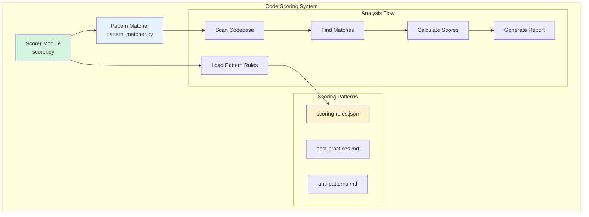
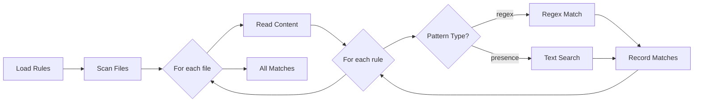
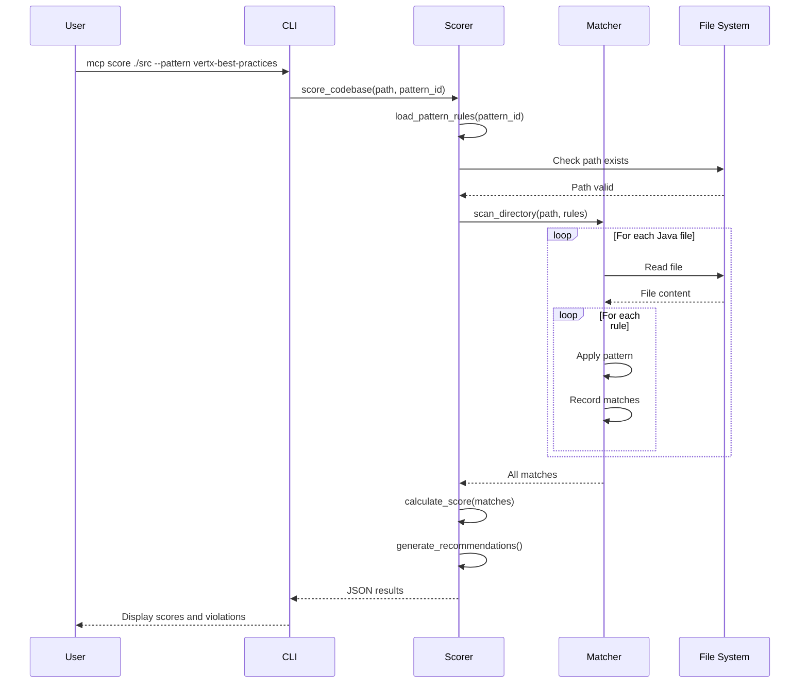
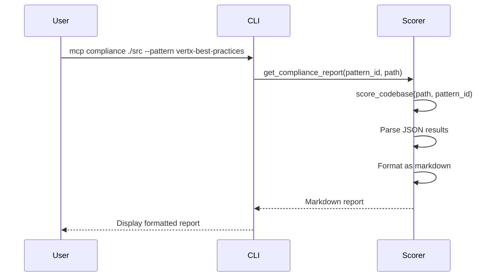

# Code Scoring Architecture

## Overview

The code scoring system provides rule-based codebase analysis against best practices and anti-patterns. It uses pattern matching (regex and text presence) to detect code quality issues and assign scores based on a category-weighted system.

## Architecture



## Components

### 1. Pattern Matcher (pattern_matcher.py)

**Purpose:** Low-level pattern matching engine for code analysis

**Key Classes:**
```python
@dataclass
class PatternMatch:
    rule_id: str         # Rule identifier
    file_path: str       # Source file path
    line_number: int     # Line where pattern found
    matched_text: str    # Actual matched text
    severity: str        # critical, high, medium, low
```

**Key Methods:**
```python
class PatternMatcher:
    def match_regex(content, pattern, file_path, rule_id, severity)
        # Regex-based pattern matching
        # Returns list of PatternMatch objects

    def match_presence(content, pattern, file_path, rule_id, severity)
        # Simple text presence check
        # Returns boolean

    def scan_file(file_path, rules)
        # Scan single file against all rules
        # Returns list of matches

    def scan_directory(dir_path, rules, extensions=['.java'])
        # Recursively scan directory
        # Returns aggregated matches
```

**Pattern Types:**
- **regex**: Full regex pattern matching
- **presence**: Simple text presence/absence check
- **absence**: Ensure pattern doesn't exist (future)

### 2. Scorer Module (scorer.py)

**Purpose:** High-level scoring logic, report generation, and pattern management

**Key Functions:**
```python
def list_patterns() -> str
    # List all available scoring patterns
    # Returns JSON array of patterns

def get_pattern_metadata(pattern_id: str) -> str
    # Get pattern metadata and scoring criteria
    # Returns JSON with categories, rules, thresholds

def score_codebase(codebase_path: str, pattern_id: str) -> str
    # Score codebase against pattern
    # Returns JSON with scores, violations, recommendations

def get_compliance_report(pattern_id: str, codebase_path: str) -> str
    # Generate markdown compliance report
    # Returns formatted markdown

def calculate_score(matches, rules, rules_data) -> Dict
    # Internal: Calculate scores from matches
    # Returns scoring dictionary

def generate_recommendations(violations, rules_data) -> List[str]
    # Generate actionable recommendations
    # Returns list of recommendation strings
```

## Scoring Rules Format

### JSON Schema

```json
{
  "pattern_id": "vertx-best-practices",
  "name": "Vert.x Best Practices Compliance",
  "description": "Evaluate Vert.x verticle code against best practices",
  "version": "1.0.0",
  "passing_threshold": 70,

  "categories": {
    "category_name": {
      "weight": 20,
      "description": "Category description",
      "rules": [
        {
          "id": "rule-id",
          "name": "Human-readable name",
          "description": "What this rule checks",
          "pattern_type": "regex|presence",
          "pattern": "Java regex pattern",
          "score": 10,              // Positive = good practice
          "severity": "critical|high|medium|low",
          "suggestion": "How to fix",
          "reference_doc": "docs/path.md"
        }
      ]
    }
  }
}
```

### Vert.x Best Practices Pattern

**Categories (5):**

1. **Deployment (20% weight)**
   - Uses DeploymentOptions (+10 points)
   - Uses Promise for async start (+10 points)

2. **Error Handling (30% weight)**
   - Checks ar.succeeded()/failed() (+15 points)
   - Try-catch in executeBlocking (+10 points)
   - No Thread.sleep **(-20 points, critical)**
   - No printStackTrace() **(-10 points)**

3. **Configuration (25% weight)**
   - Uses config() method (+10 points)
   - No hardcoded credentials **(-25 points, critical)**
   - No hardcoded URLs **(-10 points)**

4. **Database (15% weight)**
   - Uses connection pooling (+15 points)
   - Uses parameterized queries (+10 points)
   - No SQL concatenation **(-20 points, critical)**

5. **HTTP (10% weight)**
   - Uses Vert.x Router (+10 points)
   - Has error handlers (+10 points)

**Total Possible Score:** 100 points (positive rules)

**Critical Anti-Patterns (negative scores):**
- Blocking event loop: -20 points
- Hardcoded credentials: -25 points
- SQL injection: -20 points
- Hardcoded URLs: -10 points
- printStackTrace(): -10 points

## Scoring Algorithm

### 1. Pattern Matching Phase



### 2. Score Calculation

```python
# For each category:
category_score = 0
category_max = 0

# Process positive rules (best practices)
for rule in positive_rules:
    category_max += rule.score
    if pattern_found(rule):
        category_score += rule.score

# Process negative rules (anti-patterns)
for violation in violations:
    category_score += violation.score  # score is negative

# Ensure no negative scores
category_score = max(0, category_score)

# Calculate percentage
category_percentage = (category_score / category_max * 100)

# Overall score (weighted average)
overall_score = sum(category_scores * weights) / 100
```

### 3. Grade Assignment

| Score Range | Grade |
|------------|-------|
| 90-100 | A |
| 80-89 | B |
| 70-79 | C |
| 60-69 | D |
| 0-59 | F |

## Data Flow

### Scoring Flow



### Compliance Report Flow



## Output Formats

### JSON Output (score_codebase)

```json
{
  "pattern_id": "vertx-best-practices",
  "overall_score": 65,
  "grade": "D",
  "max_score": 100,

  "category_scores": {
    "deployment": {
      "score": 10,
      "max": 20,
      "violations": 0,
      "passed": 1
    },
    "error_handling": {
      "score": 0,
      "max": 25,
      "violations": 2,
      "passed": 0
    }
  },

  "summary": {
    "files_scanned": 5,
    "violations_found": 12,
    "best_practices_followed": 3,
    "critical_issues": 2,
    "high_issues": 4
  },

  "violations": [
    {
      "rule_id": "no-blocking",
      "rule_name": "No Blocking in Event Loop",
      "severity": "critical",
      "category": "error_handling",
      "file": "src/MyVerticle.java",
      "line": 42,
      "matched": "Thread.sleep(1000)",
      "message": "Thread.sleep blocks event loop",
      "suggestion": "Use vertx.setTimer() instead",
      "reference_doc": "vertx/error-handling.md"
    }
  ],

  "recommendations": [
    "⚠️  Fix 2 critical issues immediately",
    "Address 4 error_handling issues to improve compliance",
    "Review documentation: vertx/error-handling.md, vertx/config.md"
  ]
}
```

### Markdown Output (get_compliance_report)

```markdown
# Code Compliance Report

**Pattern:** vertx-best-practices
**Codebase:** /path/to/src
**Date:** 2025-01-15

## Overall Score: 65/100 (D)

## Category Scores

- **Deployment**: 50% (10/20)
  - ✅ Passed: 1
  - ❌ Violations: 0

- **Error Handling**: 0% (0/25)
  - ✅ Passed: 0
  - ❌ Violations: 2

## Summary

- Files Scanned: 5
- Violations Found: 12
- Best Practices Followed: 3
- Critical Issues: 2
- High Priority Issues: 4

## Top Issues

1. 🔴 **No Blocking in Event Loop**
   - File: `src/MyVerticle.java:42`
   - Issue: Thread.sleep blocks event loop
   - Fix: Use vertx.setTimer() instead
   - Docs: vertx/error-handling.md

## Recommendations

- ⚠️  Fix 2 critical issues immediately
- Address 4 error_handling issues
- Review documentation: vertx/error-handling.md
```

## MCP Tools

### 1. list_patterns

**Purpose:** List all available scoring patterns

**Signature:**
```python
def list_patterns() -> str
```

**Returns:**
```json
[
  {
    "pattern_id": "vertx-best-practices",
    "name": "Vert.x Best Practices Compliance",
    "description": "Evaluate Vert.x verticle code",
    "categories": ["deployment", "error_handling", ...],
    "total_rules": 15
  }
]
```

### 2. get_pattern_metadata

**Purpose:** Get pattern metadata and scoring criteria

**Signature:**
```python
def get_pattern_metadata(pattern_id: str) -> str
```

**Returns:**
```json
{
  "pattern_id": "vertx-best-practices",
  "name": "Vert.x Best Practices Compliance",
  "description": "...",
  "version": "1.0.0",
  "categories": {
    "deployment": {
      "weight": 20,
      "rule_count": 2
    }
  },
  "total_possible_score": 100,
  "passing_threshold": 70
}
```

### 3. score_codebase

**Purpose:** Score a codebase against a pattern

**Signature:**
```python
def score_codebase(codebase_path: str, pattern_id: str) -> str
```

**Parameters:**
- `codebase_path`: Path to file or directory
- `pattern_id`: Pattern identifier (e.g., "vertx-best-practices")

**Returns:** JSON with scores, violations, and recommendations

### 4. get_compliance_report

**Purpose:** Get detailed compliance report in markdown

**Signature:**
```python
def get_compliance_report(pattern_id: str, codebase_path: str) -> str
```

**Parameters:**
- `pattern_id`: Pattern identifier
- `codebase_path`: Path to analyze

**Returns:** Markdown formatted compliance report

## CLI Commands

```bash
# List available patterns
mcp list-patterns

# Get pattern info
mcp pattern-info vertx-best-practices

# Score a file
mcp score ./src/MyVerticle.java --pattern vertx-best-practices

# Score a directory
mcp score ./verticles/ -p vertx-best-practices

# Generate compliance report
mcp compliance ./src --pattern vertx-best-practices
```

## Extensibility

### Adding New Patterns

1. Create pattern directory:
   ```
   docs/patterns/my-pattern/
   ├── scoring-rules.json       # Rule definitions
   ├── best-practices.md        # Best practices guide
   └── anti-patterns.md         # Anti-patterns guide
   ```

2. Define rules in `scoring-rules.json`:
   ```json
   {
     "pattern_id": "my-pattern",
     "name": "My Pattern Name",
     "categories": {
       "category1": {
         "weight": 50,
         "rules": [...]
       }
     }
   }
   ```

3. Restart server - pattern automatically available

### Supported File Types

Currently:
- `.java` (primary)

Future:
- `.kt` (Kotlin)
- `.groovy` (Groovy)
- `.js`, `.ts` (JavaScript/TypeScript)
- `.py` (Python)

## Performance

### Benchmarks

| Operation | Time (per file) | Complexity |
|-----------|----------------|------------|
| Pattern matching | < 10ms | O(n*m) |
| Score calculation | < 5ms | O(m) |
| Report generation | < 20ms | O(v) |

Where:
- n = file size (lines)
- m = number of rules
- v = number of violations

### Optimization Strategies

1. **Caching**: Pattern rules cached in memory
2. **Parallel Scanning**: Directory scanning can be parallelized
3. **Early Exit**: Stop scanning if score is already failing
4. **Selective Rules**: Apply only relevant rules per file type

## Design Decisions

### Why Regex Instead of AST?

**Current Approach: Regex**
- ✅ Fast execution
- ✅ Simple implementation
- ✅ Works for most patterns
- ✅ No language-specific dependencies
- ❌ Can have false positives
- ❌ Can't detect complex semantic issues

**Future Enhancement: AST Parsing**
- ✅ More accurate
- ✅ Semantic analysis
- ✅ Context-aware
- ❌ Slower
- ❌ Language-specific (need javalang, etc.)
- ❌ More complex implementation

**Decision:** Start with regex for speed and simplicity. Add AST support as opt-in for advanced patterns.

### Why Category-Weighted Scoring?

**Advantages:**
- Different aspects have different importance
- Customizable weights per project
- Clear score breakdown
- Easy to understand

**Alternatives Considered:**
- Flat scoring: Too simplistic
- Machine learning: Overkill for rule-based system
- Boolean pass/fail: Not nuanced enough

## Future Enhancements

1. **AST-Based Scoring** - Java AST parsing with javalang
2. **Custom Patterns** - User-defined scoring patterns via UI
3. **Pattern Inheritance** - Base patterns + customizations
4. **Historical Tracking** - Track scores over time
5. **CI/CD Integration** - Fail builds on low scores
6. **IDE Integration** - Real-time scoring in editors
7. **Multi-Language** - Support for Kotlin, Groovy, JavaScript
8. **Semantic Analysis** - Context-aware pattern detection
9. **Fix Suggestions** - Auto-generate fix patches
10. **Pattern Marketplace** - Community-shared patterns

## References

- Pattern Definitions: `docs/patterns/vertx/scoring-rules.json`
- Best Practices: `docs/patterns/vertx/best-practices.md`
- Anti-Patterns: `docs/patterns/vertx/anti-patterns.md`
- Tests: `tests/test_pattern_matcher.py`, `tests/test_scorer.py`

---

**Last Updated:** January 2025
**Version:** 1.0
**Test Coverage:** 33 tests (14 pattern matcher + 19 scorer)
