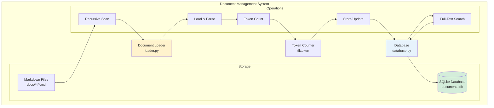
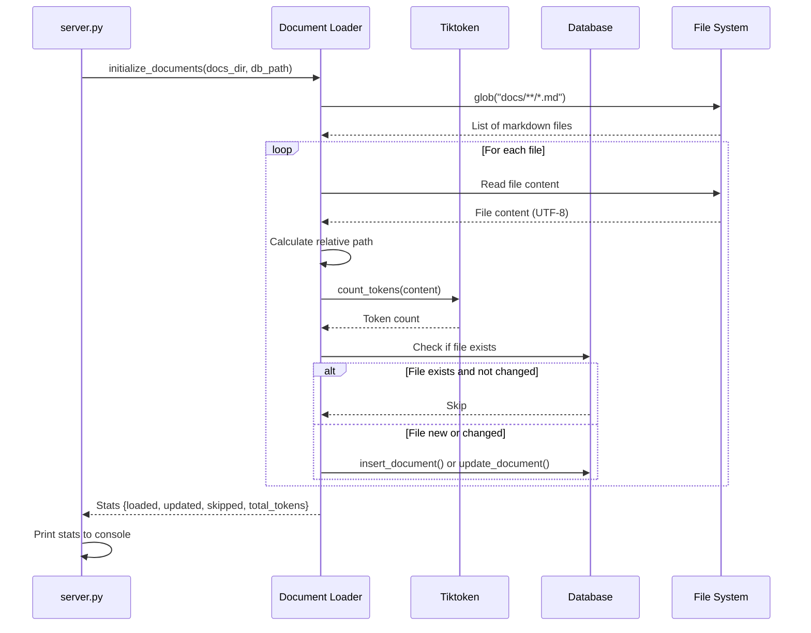
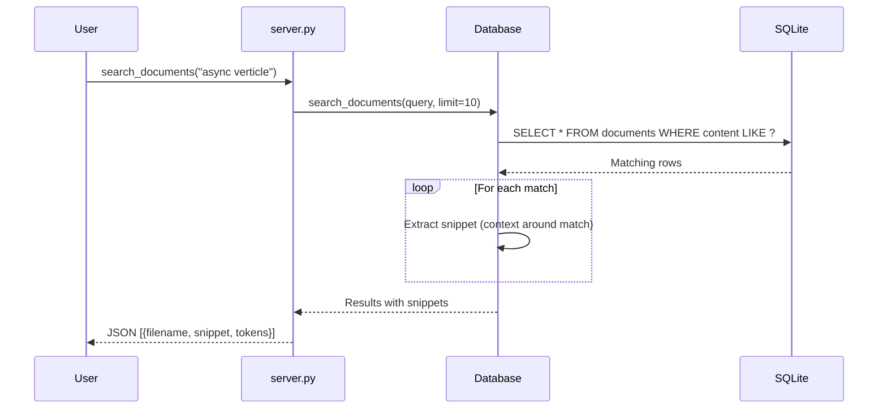
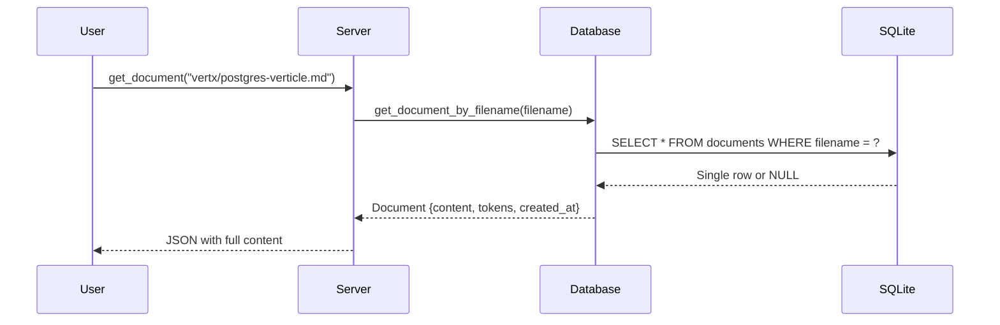

# Document Management Design

## Overview

The document management system provides intelligent indexing, storage, and search of markdown documentation. It automatically scans the `docs/` folder, extracts content, counts tokens, and stores everything in SQLite for fast retrieval.

## Architecture



## Components

### 1. Database Module (database.py)

**Purpose**: SQLite operations for document storage and retrieval

**Key Class**:
```python
class DocumentDatabase:
    def __init__(self, db_path: str)
        # Initialize database connection

    def connect(self)
        # Establish SQLite connection
        # Create tables if not exist

    def insert_document(self, filename, content, tokens)
        # Insert new document
        # Raises error on duplicate filename

    def update_document(self, filename, content, tokens)
        # Update existing document

    def search_documents(self, query, limit=10)
        # Full-text search with snippets
        # Returns list of matching docs

    def get_document_by_filename(self, filename)
        # Retrieve specific document
        # Returns None if not found

    def get_all_documents(self)
        # List all documents with metadata
        # Returns list of {id, filename, tokens, created_at}

    def get_total_tokens(self)
        # Aggregate token count across all docs
```

**Database Schema**:
```sql
CREATE TABLE documents (
    id INTEGER PRIMARY KEY AUTOINCREMENT,
    filename TEXT NOT NULL UNIQUE,
    content TEXT NOT NULL,
    tokens INTEGER NOT NULL,
    created_at TIMESTAMP DEFAULT CURRENT_TIMESTAMP
);
```

**Indexes**:
- Primary key: `id`
- Unique constraint: `filename`

**Context Manager Support**:
```python
with DocumentDatabase(db_path) as db:
    db.insert_document(...)
    # Auto-closes on exit
```

---

### 2. Loader Module (loader.py)

**Purpose**: Scan filesystem, load documents, count tokens, populate database

**Key Functions**:
```python
def count_tokens(text: str) -> int
    # Count tokens using tiktoken (cl100k_base encoding)
    # Returns integer token count

def load_file(file_path: str, db_path: str) -> bool
    # Load single markdown file into database
    # Returns True if successful

def load_all_documents(docs_dir: str, db_path: str, force_reload=False)
    # Recursively scan and load all markdown files
    # Returns stats: {loaded, updated, skipped, errors, total_tokens}

def initialize_documents(docs_dir: str, db_path: str)
    # Main initialization function
    # Called on server startup
```

**Loading Process**:
1. Scan `docs_dir` using `glob("**/*.md")`
2. For each file:
   - Read content (UTF-8 encoding)
   - Calculate relative path
   - Count tokens
   - Insert or update in database
3. Return statistics

**Token Counting**:
- Uses tiktoken library
- Encoding: `cl100k_base` (GPT-4, GPT-3.5-turbo)
- Accurate for LLM context estimation

---

## Data Flow

### Startup Flow



### Search Flow



### Retrieval Flow



---

## MCP Tools

### 1. search_documents

**Purpose**: Search documents by content with contextual snippets

**Signature**:
```python
def search_documents(query: str, limit: int = 10) -> str
```

**Parameters**:
- `query`: Search string to find in document content
- `limit`: Maximum results to return (default: 10)

**Returns**:
```json
[
  {
    "id": 1,
    "filename": "vertx/templates/postgres-verticle.md",
    "snippet": "...PgPool pool = PgPool.pool(vertx, connectOptions, poolOptions)...",
    "tokens": 450,
    "created_at": "2025-01-15 10:30:00"
  }
]
```

**Search Algorithm**:
1. Execute SQLite LIKE query: `WHERE content LIKE '%query%'`
2. For each match, extract snippet (100 chars before/after)
3. Return results ordered by relevance (can be enhanced)
4. Limit to specified number

**Future Enhancements**:
- Full-text search (FTS5)
- Relevance ranking
- Fuzzy matching
- Semantic search

---

### 2. get_all_documents

**Purpose**: List all indexed documents with metadata

**Signature**:
```python
def get_all_documents() -> str
```

**Returns**:
```json
[
  {
    "id": 1,
    "filename": "vertx/postgres-verticle.md",
    "tokens": 450,
    "created_at": "2025-01-15 10:30:00"
  },
  {
    "id": 2,
    "filename": "mcp-overview.md",
    "tokens": 320,
    "created_at": "2025-01-15 10:30:01"
  }
]
```

**Use Cases**:
- List available documentation
- Calculate total token count
- Monitor documentation growth

---

### 3. get_document

**Purpose**: Retrieve full content of a specific document

**Signature**:
```python
def get_document(filename: str) -> str
```

**Parameters**:
- `filename`: Relative path from docs/ (e.g., "vertx/postgres-verticle.md")

**Returns**:
```json
{
  "id": 1,
  "filename": "vertx/templates/postgres-verticle.md",
  "content": "# PostgreSQL Verticle\n\n## Overview\n\n...",
  "tokens": 450,
  "created_at": "2025-01-15 10:30:00"
}
```

**Error Handling**:
- Returns error message if document not found
- Returns "Database not initialized" if DB unavailable

---

## CLI Commands

```bash
# Search documentation
mcp search "postgres verticle" --limit 5

# Quick search (alias)
mcp ask "how to configure postgres"

# List all documents
mcp list-docs

# Get specific document
mcp get "vertx/templates/postgres-verticle.md"
```

---

## Performance Characteristics

### Benchmarks

| Operation | Time | Complexity | Notes |
|-----------|------|------------|-------|
| Initial load (14 docs) | ~1.5s | O(n) | Includes token counting |
| Document search | < 50ms | O(n) | Linear scan with LIKE |
| Document retrieval | < 5ms | O(1) | Indexed by filename |
| Token aggregation | < 10ms | O(n) | SUM query |
| Update check | < 1ms | O(1) | Filename lookup |

### Scalability

**Current**:
- 14 documents
- ~11,470 tokens total
- < 2s startup time

**Projected**:
- 1,000 documents: ~10s startup, 100ms search
- 10,000 documents: ~100s startup, 1s search

**Optimization Strategies**:
1. Add SQLite FTS5 index for full-text search
2. Cache frequently accessed documents
3. Implement incremental loading (only changed files)
4. Add background indexing
5. Use vector embeddings for semantic search

---

## Design Decisions

### 1. Why Store Full Content in SQLite?

**Decision**: Store entire markdown content in database

**Rationale**:
- ✅ Fast retrieval (no file I/O)
- ✅ ACID compliance
- ✅ Atomic updates
- ✅ Search without external indexer

**Trade-offs**:
- ❌ Database size grows with content
- ❌ No file-level granularity

**Alternatives Considered**:
- Store paths only: Requires file I/O on every access
- Hybrid approach: Store snippets only

---

### 2. Why Relative Paths?

**Decision**: Store `vertx/postgres-verticle.md` not just `postgres-verticle.md`

**Rationale**:
- ✅ Supports nested folder structure
- ✅ Prevents filename collisions
- ✅ Preserves organization
- ✅ Easier to locate files

**Trade-offs**:
- ❌ Paths break if files move

**Solution**: Use unique constraint + graceful error handling

---

### 3. Why cl100k_base Encoding?

**Decision**: Use OpenAI's cl100k_base encoding for token counting

**Rationale**:
- ✅ Accurate for GPT-4, GPT-3.5-turbo
- ✅ Official OpenAI library
- ✅ Fast (Rust implementation)
- ✅ Industry standard

**Alternatives**:
- Character count / 4: Less accurate
- Word count * 1.3: Approximation
- Different encoding: Inconsistent with GPT models

---

### 4. Why LIKE Instead of FTS5?

**Decision**: Use simple LIKE queries for initial version

**Rationale**:
- ✅ Simple implementation
- ✅ No additional setup
- ✅ Works for small doc sets
- ✅ Adequate for current scale

**Future Enhancement**: Add FTS5 when scaling beyond 1,000 docs

---

## Error Handling

### File Loading Errors

| Error | Handling |
|-------|----------|
| File not found | Skip, log error, continue |
| Invalid UTF-8 | Try fallback encoding, skip on fail |
| Permission denied | Skip, log error |
| Database constraint | Update existing instead of insert |

### Search Errors

| Error | Handling |
|-------|----------|
| Empty query | Return empty results |
| Database not initialized | Return error message |
| No results | Return empty array |

### Retrieval Errors

| Error | Handling |
|-------|----------|
| File not found | Return error JSON |
| Invalid filename | Return error JSON |
| Database error | Log and return error |

---

## Testing

### Test Coverage (13 tests)

```python
# Database tests (test_database.py)
test_database_connect()
test_insert_document()
test_insert_duplicate_document()  # Constraint violation
test_update_document()
test_search_documents()
test_search_documents_case_insensitive()
test_search_documents_with_limit()
test_get_all_documents()
test_get_document_by_filename()
test_get_nonexistent_document()
test_get_total_tokens()
test_get_total_tokens_empty_db()
test_context_manager()
```

```python
# Loader tests (test_loader.py)
test_count_tokens()
test_count_tokens_empty_string()
test_load_file()
test_load_nonexistent_file()
test_load_all_documents()
test_load_all_documents_skip_existing()
test_load_all_documents_force_reload()
test_load_all_documents_empty_directory()
test_load_directory_custom_path()
test_initialize_documents()
test_load_invalid_utf8_file()
test_different_encodings()
```

### Test Strategy

**Unit Tests**:
- Isolated database operations
- Token counting accuracy
- File loading logic

**Integration Tests**:
- Full startup sequence
- End-to-end search flow
- Multi-file loading

**Edge Cases**:
- Empty database
- Duplicate filenames
- Invalid UTF-8
- Missing files

---

## Future Enhancements

### 1. Full-Text Search (FTS5)

Add SQLite FTS5 virtual table for better search:

```sql
CREATE VIRTUAL TABLE documents_fts USING fts5(
    filename, content, tokenize='porter'
);
```

**Benefits**:
- Faster search (< 10ms)
- Relevance ranking
- Boolean operators
- Phrase matching

---

### 2. Semantic Search

Add vector embeddings for semantic similarity:

```python
# Generate embeddings
embedding = openai.Embedding.create(input=content)

# Store in separate table
embeddings(doc_id, embedding_vector)

# Similarity search
results = find_similar(query_embedding, top_k=10)
```

**Benefits**:
- Conceptual matching
- No exact keyword required
- Better for questions

---

### 3. Incremental Updates

Watch filesystem for changes:

```python
from watchdog.observers import Observer

def on_modified(event):
    reload_document(event.src_path)
```

**Benefits**:
- No restart required
- Always up-to-date
- Better dev experience

---

### 4. Document Metadata

Add frontmatter parsing:

```yaml
---
title: PostgreSQL Verticle
category: Vert.x
tags: [database, postgres, verticle]
---
```

Store in database:
```sql
ALTER TABLE documents ADD COLUMN metadata TEXT;
```

**Benefits**:
- Better organization
- Tag-based filtering
- Category browsing

---

## References

- SQLite Docs: https://sqlite.org/docs.html
- Tiktoken: https://github.com/openai/tiktoken
- FTS5: https://sqlite.org/fts5.html
- Database Module: `src/fast_mcp_local/database.py`
- Loader Module: `src/fast_mcp_local/loader.py`
- Tests: `tests/test_database.py`, `tests/test_loader.py`

---

**Last Updated**: January 2025
**Version**: 1.0
**Test Coverage**: 25 tests (13 database + 12 loader)
