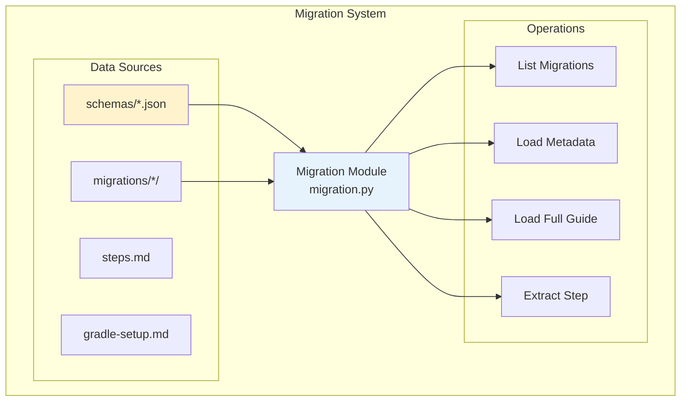
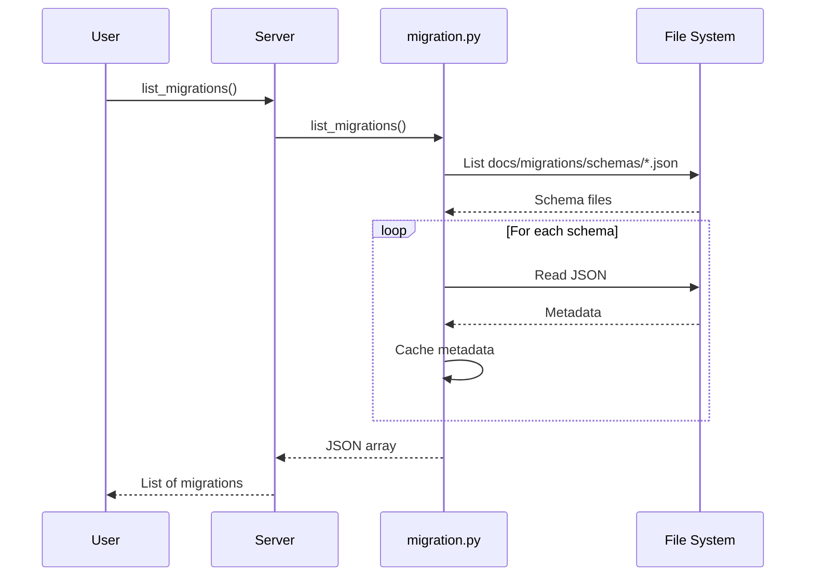
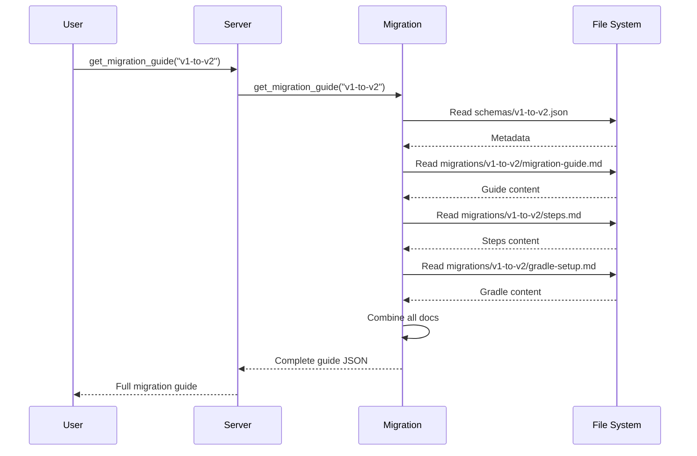
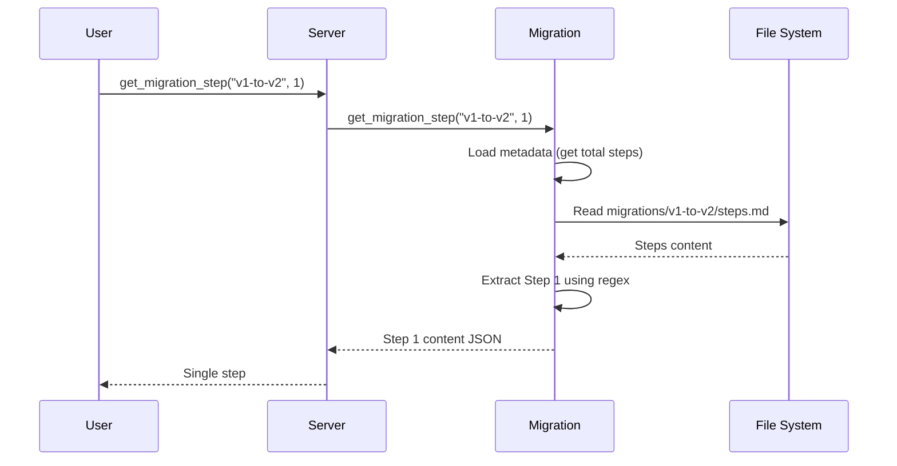

# Migration System Design

## Overview

The migration system provides step-by-step guidance for code migrations, focusing on OpenRewrite-based automated refactoring. It manages migration guides, metadata, and orchestrates the migration process through structured documentation.

## Architecture



## Components

### Migration Module (migration.py)

**Purpose**: Manage migration guides and provide step-by-step instructions

**Key Functions**:
```python
def list_migrations() -> str
    # List all available migrations
    # Returns JSON array of metadata

def get_migration_metadata(migration_id: str) -> str
    # Get metadata for specific migration
    # Returns JSON with versions, deps, steps

def get_migration_guide(migration_id: str) -> str
    # Get complete migration guide
    # Returns JSON with all documentation

def get_migration_step(migration_id: str, step_number: int) -> str
    # Extract specific step from guide
    # Returns JSON with step content

def extract_step_from_markdown(markdown: str, step_number: int) -> Optional[str]
    # Internal: Parse step from markdown
    # Returns step content or None

def list_migration_ids() -> List[str]
    # Internal: Get all migration IDs
```

**Metadata Caching**:
- Load metadata once on first access
- Cache in memory dictionary
- Clear cache method for testing

---

## Data Flow

### List Migrations Flow



### Get Migration Guide Flow



### Get Migration Step Flow



---

## MCP Tools

### 1. list_migrations

**Purpose**: List all available migration guides

**Signature**:
```python
def list_migrations() -> str
```

**Returns**:
```json
[
  {
    "migration_id": "v1-to-v2",
    "name": "V1 to V2 Migration",
    "description": "Migrate from version 1.x to 2.x",
    "source_version": "1.x",
    "target_version": "2.x",
    "openrewrite_dependency": {
      "group": "com.example",
      "artifact": "migration-recipes",
      "version": "1.0.0",
      "recipe_class": "com.example.V1ToV2Migration"
    },
    "prerequisites": {
      "java_version": "11+",
      "gradle_version": "7.0+"
    },
    "total_steps": 5,
    "estimated_time": "15-20 minutes",
    "tags": ["openrewrite", "migration", "automated"]
  }
]
```

---

### 2. get_migration_metadata

**Purpose**: Get detailed metadata for a specific migration

**Signature**:
```python
def get_migration_metadata(migration_id: str) -> str
```

**Parameters**:
- `migration_id`: Migration identifier (e.g., "v1-to-v2")

**Returns**:
```json
{
  "migration_id": "v1-to-v2",
  "name": "V1 to V2 Migration",
  "description": "Migrate from version 1.x to 2.x",
  "source_version": "1.x",
  "target_version": "2.x",
  "openrewrite_dependency": {
    "group": "com.example",
    "artifact": "migration-recipes",
    "version": "1.0.0",
    "recipe_class": "com.example.V1ToV2Migration"
  },
  "prerequisites": {
    "java_version": "11+",
    "gradle_version": "7.0+"
  },
  "total_steps": 5,
  "estimated_time": "15-20 minutes",
  "tags": ["openrewrite", "migration", "automated"]
}
```

**Error Handling**:
```json
{
  "error": "Migration 'invalid-id' not found",
  "available_migrations": ["v1-to-v2"]
}
```

---

### 3. get_migration_guide

**Purpose**: Get complete migration guide with all documentation

**Signature**:
```python
def get_migration_guide(migration_id: str) -> str
```

**Parameters**:
- `migration_id`: Migration identifier

**Returns**:
```json
{
  "migration_id": "v1-to-v2",
  "metadata": {
    "name": "V1 to V2 Migration",
    "source_version": "1.x",
    "target_version": "2.x",
    "total_steps": 5
  },
  "guide": "# V1 to V2 Migration Guide\n\n## Overview\n\n...",
  "steps": "# Migration Steps\n\n## Step 1: Add OpenRewrite Plugin\n\n...",
  "gradle_setup": "# Gradle Setup\n\n## Add OpenRewrite Plugin\n\n..."
}
```

---

### 4. get_migration_step

**Purpose**: Get specific step instructions from migration guide

**Signature**:
```python
def get_migration_step(migration_id: str, step_number: int) -> str
```

**Parameters**:
- `migration_id`: Migration identifier
- `step_number`: Step number (1-based)

**Returns**:
```json
{
  "migration_id": "v1-to-v2",
  "step_number": 1,
  "total_steps": 5,
  "content": "## Step 1: Add OpenRewrite Plugin\n\n### Action\n\nAdd the OpenRewrite plugin to your build.gradle:\n\n```gradle\nplugins {\n    id 'org.openrewrite.rewrite' version '6.0.0'\n}\n```\n\n### Verification\n\nRun: `./gradlew rewriteDiscover`"
}
```

**Error Handling**:
```json
{
  "error": "Step 10 out of range. Migration has 5 steps.",
  "migration_id": "v1-to-v2",
  "total_steps": 5
}
```

---

## CLI Commands

```bash
# List all migrations
mcp list-migrations

# Get migration metadata
mcp migration-info v1-to-v2

# Get full migration guide
mcp migration-guide v1-to-v2

# Get specific step
mcp migration-step v1-to-v2 1
mcp migration-step v1-to-v2 2
```

---

## Migration Structure

### Directory Layout

```
docs/migrations/
├── v1-to-v2/                    # Migration directory
│   ├── migration-guide.md       # Overview and introduction
│   ├── steps.md                 # Step-by-step instructions
│   └── gradle-setup.md          # Gradle configuration reference
└── schemas/                     # Migration metadata
    └── v1-to-v2.json            # Metadata schema
```

### Metadata Schema Format

Location: `docs/migrations/schemas/{migration-id}.json`

```json
{
  "migration_id": "v1-to-v2",
  "name": "V1 to V2 Migration",
  "description": "Migrate from version 1.x to 2.x with OpenRewrite",

  "source_version": "1.x",
  "target_version": "2.x",

  "openrewrite_dependency": {
    "group": "com.example",
    "artifact": "migration-recipes",
    "version": "1.0.0",
    "recipe_class": "com.example.V1ToV2Migration"
  },

  "prerequisites": {
    "java_version": "11+",
    "gradle_version": "7.0+",
    "other": ["git", "text editor"]
  },

  "total_steps": 5,
  "estimated_time": "15-20 minutes",

  "tags": ["openrewrite", "migration", "automated"],

  "documentation_files": {
    "guide": "migration-guide.md",
    "steps": "steps.md",
    "gradle_setup": "gradle-setup.md"
  }
}
```

### Steps Markdown Format

Location: `docs/migrations/{migration-id}/steps.md`

```markdown
# Migration Steps

## Step 1: Add OpenRewrite Plugin

### Action

Add the OpenRewrite plugin to your `build.gradle`:

```gradle
plugins {
    id 'org.openrewrite.rewrite' version '6.0.0'
}
```

### Verification

Run: `./gradlew rewriteDiscover`

## Step 2: Add Migration Recipe Dependency

### Action

Add the migration recipe to your dependencies:

```gradle
dependencies {
    rewrite 'com.example:migration-recipes:1.0.0'
}
```

### Verification

Run: `./gradlew rewriteDiscover` and verify the recipe is listed.
```

**Step Extraction**:
- Uses regex: `## Step (\d+):(.+?)(?=## Step|\Z)`
- Captures step number and content
- Returns None if step not found

---

## Design Decisions

### 1. Why Document-Based Migrations?

**Decision**: Use markdown guides instead of executable scripts

**Rationale**:
- ✅ Human-readable
- ✅ Git-friendly (diffs, history)
- ✅ Flexible (any tool, not just OpenRewrite)
- ✅ Safe (no code execution)
- ✅ Self-documenting

**Trade-offs**:
- ❌ Not automated end-to-end
- ❌ User must execute commands

**Philosophy**: Provide guidance, not automation. Users should understand each step.

---

### 2. Why Step-by-Step Format?

**Decision**: Break migrations into numbered steps

**Rationale**:
- ✅ Clear progression
- ✅ Resumable (can pause and continue)
- ✅ Verifiable (check after each step)
- ✅ Easier to troubleshoot

**Benefits**:
- Users can stop and resume
- Clear checkpoints
- Better error recovery

---

### 3. Why OpenRewrite Focus?

**Decision**: Design system around OpenRewrite workflows

**Rationale**:
- ✅ OpenRewrite is industry standard for Java migrations
- ✅ Automated refactoring capabilities
- ✅ Large recipe ecosystem
- ✅ Gradle/Maven integration

**Extensibility**: System supports any migration tool, not just OpenRewrite

---

## Step Extraction Algorithm

### Regex Pattern

```python
pattern = r'## Step (\d+):(.+?)(?=## Step|\Z)'
```

**Explanation**:
- `## Step (\d+):` - Match "## Step 1:", "## Step 2:", etc.
- `(.+?)` - Capture step content (non-greedy)
- `(?=## Step|\Z)` - Stop at next step or end of file

**Example**:
```markdown
## Step 1: Add Plugin

Content for step 1...

## Step 2: Configure

Content for step 2...
```

Extracts:
- Step 1: "Add Plugin\n\nContent for step 1..."
- Step 2: "Configure\n\nContent for step 2..."

---

## Performance

### Benchmarks

| Operation | Time | Notes |
|-----------|------|-------|
| List migrations (first time) | < 10ms | Reads all schemas |
| List migrations (cached) | < 1ms | Memory lookup |
| Get metadata | < 5ms | Read JSON |
| Get full guide | < 15ms | Read 3 markdown files |
| Extract step | < 10ms | Regex extraction |

### Optimization

- **Metadata Caching**: Load schemas once
- **Lazy Loading**: Load guide docs on demand
- **Step Caching**: Consider caching parsed steps

---

## Testing

### Test Coverage (18 tests)

```python
# Migration Tests (test_migration.py)
test_list_migrations()
test_get_migration_metadata_v1_to_v2()
test_get_migration_metadata_nonexistent()
test_get_migration_guide()
test_get_migration_guide_nonexistent()
test_get_migration_step_1()
test_get_migration_step_all_steps()
test_get_migration_step_out_of_range()
test_get_migration_step_nonexistent_migration()
test_extract_step_from_markdown()
test_extract_step_from_markdown_not_found()
test_list_migration_ids()
test_clear_cache()
test_migration_metadata_structure()
test_migration_guide_gradle_setup()
test_migration_steps_content()
test_migration_steps_order()
test_json_output_format()
```

---

## Extensibility

### Adding New Migrations

**Steps**:

1. **Create migration directory**:
   ```bash
   mkdir docs/migrations/v2-to-v3
   ```

2. **Create documentation files**:
   ```
   docs/migrations/v2-to-v3/
   ├── migration-guide.md    # Overview
   ├── steps.md              # Step-by-step
   └── gradle-setup.md       # Reference
   ```

3. **Create metadata schema**:
   ```json
   // docs/migrations/schemas/v2-to-v3.json
   {
     "migration_id": "v2-to-v3",
     "name": "V2 to V3 Migration",
     "total_steps": 7,
     ...
   }
   ```

4. **Restart server** - Auto-discovered!

**No code changes required!**

---

## Future Enhancements

### 1. Interactive Migration Wizard

Command-line wizard:

```bash
mcp migrate --wizard
> Select migration: v1-to-v2
> Step 1: Add OpenRewrite Plugin
  Execute now? [y/n]: y
  ✅ Plugin added to build.gradle
> Step 2: Add Recipe Dependency
  Execute now? [y/n]: y
  ✅ Dependency added
```

---

### 2. Migration Progress Tracking

Track user progress:

```json
{
  "migration_id": "v1-to-v2",
  "started_at": "2025-01-15T10:00:00Z",
  "completed_steps": [1, 2, 3],
  "current_step": 4,
  "total_steps": 5,
  "status": "in_progress"
}
```

---

### 3. Automated Verification

Execute verification commands:

```python
def verify_step(migration_id, step_number):
    # Parse verification command from step
    # Execute command
    # Return pass/fail
```

---

### 4. Multi-Project Migrations

Support monorepo migrations:

```bash
mcp migrate v1-to-v2 --projects service-a,service-b,service-c
```

---

### 5. Migration Rollback

Support rollback steps:

```markdown
## Step 1: Add Plugin

### Action
...

### Rollback
Remove plugin from build.gradle:
```gradle
// Remove this line
id 'org.openrewrite.rewrite' version '6.0.0'
```
```

---

## References

- Migration Module: `src/fast_mcp_local/migration.py`
- Migration Docs: `docs/migrations/`
- Schemas: `docs/migrations/schemas/`
- Tests: `tests/test_migration.py`
- OpenRewrite Docs: https://docs.openrewrite.org/

---

**Last Updated**: January 2025
**Version**: 1.0
**Test Coverage**: 18 tests
