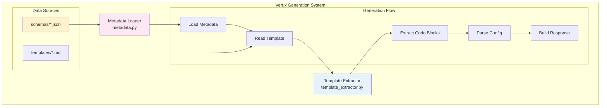
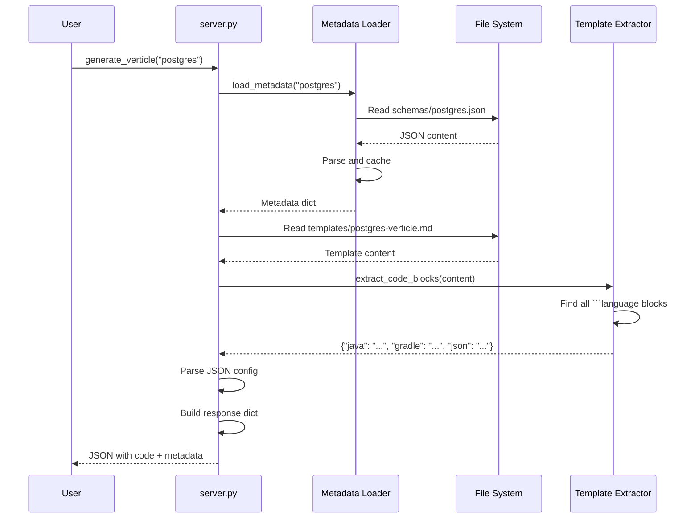
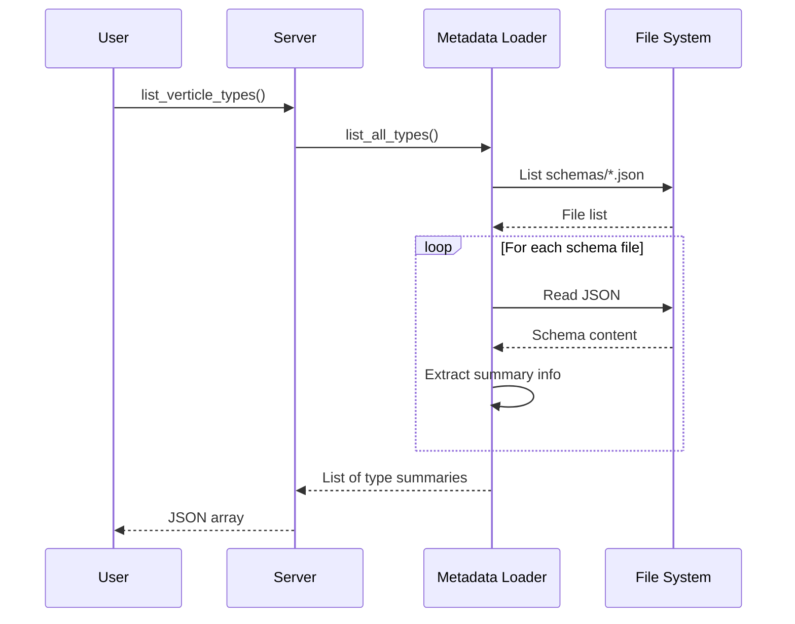

# Vert.x Code Generation Design

## Overview

The Vert.x code generation system provides template-based verticle code generation without requiring LLMs. It extracts Java code, Gradle dependencies, and configuration from markdown templates, guided by JSON metadata schemas.

## Architecture



## Components

### 1. Metadata Loader (metadata.py)

**Purpose**: Load and cache verticle metadata from JSON schemas

**Key Class**:
```python
class VerticleMetadata:
    def __init__(self, schemas_dir: Path)
        # Initialize with path to schemas directory

    def load_metadata(self, verticle_type: str) -> Optional[Dict]
        # Load metadata for specific type
        # Returns None if not found
        # Caches in memory

    def list_all_types(self) -> List[Dict]
        # List all available verticle types
        # Returns metadata summaries

    def clear_cache(self)
        # Clear metadata cache
```

**Metadata Schema Format**:
```json
{
  "type": "postgres",
  "name": "PostgreSQL Verticle",
  "description": "Database client verticle for PostgreSQL",
  "template_file": "templates/postgres-verticle.md",
  "gradle_dependencies": [
    "io.vertx:vertx-core:4.5.0",
    "io.vertx:vertx-pg-client:4.5.0"
  ],
  "config_keys": [
    "postgres.host",
    "postgres.port",
    "postgres.database",
    "postgres.user",
    "postgres.password"
  ],
  "use_cases": [
    "CRUD operations",
    "Connection pooling",
    "Async database queries"
  ]
}
```

**Caching Strategy**:
- Load metadata once on first access
- Cache in memory (dict)
- Clear cache method for testing

---

### 2. Template Extractor (template_extractor.py)

**Purpose**: Parse markdown templates and extract code blocks

**Key Class**:
```python
class TemplateExtractor:
    def extract_code_blocks(self, markdown: str) -> Dict[str, str]
        # Extract all fenced code blocks
        # Returns {"java": "...", "gradle": "...", "json": "..."}

    def extract_description(self, markdown: str) -> str
        # Extract description section
        # Returns markdown text

    def extract_section(self, markdown: str, heading: str) -> str
        # Extract arbitrary section by heading
        # Returns section content
```

**Code Block Detection**:
Uses regex to find fenced code blocks:
```python
pattern = r'```(\w+)\n(.*?)```'
matches = re.findall(pattern, markdown, re.DOTALL)
```

**Supported Languages**:
- `java` - Verticle code
- `gradle` - Dependencies
- `json` - Configuration
- `deployment` - Deployment examples

**Special Handling**:
- Multiple Java blocks: Concatenated
- Deployment vs verticle code: Heuristics (contains "DeploymentOptions")
- JSON parsing: Attempt parse, fallback to raw string

---

## Data Flow

### Generation Flow



### List Types Flow



---

## MCP Tools

### 1. generate_verticle

**Purpose**: Generate complete Vert.x verticle from template

**Signature**:
```python
def generate_verticle(verticle_type: str) -> str
```

**Parameters**:
- `verticle_type`: Type identifier (e.g., "postgres", "http")

**Returns**:
```json
{
  "type": "postgres",
  "name": "PostgreSQL Verticle",
  "description": "Database client verticle for PostgreSQL",
  "verticle_code": "package com.example.verticles;\n\nimport io.vertx.core.AbstractVerticle;\n...",
  "gradle_dependencies": [
    "io.vertx:vertx-core:4.5.0",
    "io.vertx:vertx-pg-client:4.5.0"
  ],
  "config_example": {
    "postgres": {
      "host": "localhost",
      "port": 5432,
      "database": "mydb"
    }
  },
  "deployment_example": "DeploymentOptions options = new DeploymentOptions()...",
  "use_cases": [
    "CRUD operations",
    "Connection pooling"
  ]
}
```

**Error Handling**:
```json
{
  "error": "Unknown verticle type: invalid",
  "available_types": ["postgres", "http"]
}
```

---

### 2. list_verticle_types

**Purpose**: List all available verticle templates

**Signature**:
```python
def list_verticle_types() -> str
```

**Returns**:
```json
[
  {
    "type": "postgres",
    "name": "PostgreSQL Verticle",
    "description": "Database client verticle for PostgreSQL",
    "gradle_deps": ["io.vertx:vertx-pg-client:4.5.0"]
  },
  {
    "type": "http",
    "name": "HTTP Server Verticle",
    "description": "REST API server with routing",
    "gradle_deps": ["io.vertx:vertx-web:4.5.0"]
  }
]
```

---

## CLI Commands

```bash
# Generate verticle code
mcp generate postgres
mcp generate http

# List available types
mcp list-verticles
```

---

## Template Structure

### Markdown Template Format

```markdown
# PostgreSQL Verticle

## Description

Database client verticle for PostgreSQL with connection pooling and async queries.

## Verticle Code

```java
package com.example.verticles;

import io.vertx.core.AbstractVerticle;
import io.vertx.core.Promise;
// ... imports ...

public class PostgresVerticle extends AbstractVerticle {
    // ... code ...
}
```

## Gradle Dependencies

```gradle
dependencies {
    implementation 'io.vertx:vertx-core:4.5.0'
    implementation 'io.vertx:vertx-pg-client:4.5.0'
}
```

## Configuration

```json
{
  "postgres": {
    "host": "localhost",
    "port": 5432,
    "database": "mydb"
  }
}
```

## Deployment

```java
DeploymentOptions options = new DeploymentOptions()
    .setConfig(config)
    .setInstances(4);

vertx.deployVerticle(new PostgresVerticle(), options);
```
```

### JSON Schema Format

Location: `docs/vertx/schemas/{type}.json`

```json
{
  "type": "postgres",
  "name": "PostgreSQL Verticle",
  "description": "Database client verticle for PostgreSQL",
  "template_file": "templates/postgres-verticle.md",
  "gradle_dependencies": [
    "io.vertx:vertx-core:4.5.0",
    "io.vertx:vertx-pg-client:4.5.0"
  ],
  "config_keys": [
    "postgres.host",
    "postgres.port",
    "postgres.database",
    "postgres.user",
    "postgres.password"
  ],
  "use_cases": [
    "CRUD operations",
    "Connection pooling",
    "Async database queries"
  ]
}
```

---

## Design Decisions

### 1. Why Templates Instead of LLMs?

**Decision**: Use markdown templates for code generation

**Rationale**:
- ✅ Deterministic output
- ✅ No API keys or costs
- ✅ Instant generation (< 10ms)
- ✅ Full control over code quality
- ✅ Easy to version and review
- ✅ Works offline

**Trade-offs**:
- ❌ Less flexible than LLMs
- ❌ Manual template creation
- ❌ Limited customization

**Alternatives Considered**:
- LLM generation: Costs, latency, non-deterministic
- Code scaffolding tools: Less flexible
- Yeoman generators: Heavier, Node.js dependency

---

### 2. Why Separate Metadata and Templates?

**Decision**: Store metadata in JSON, code in markdown

**Rationale**:
- ✅ Separation of concerns
- ✅ JSON easier for metadata
- ✅ Markdown better for code
- ✅ Independent versioning
- ✅ Easier validation

**Trade-offs**:
- ❌ Two files per verticle type
- ❌ Must keep in sync

**Solution**: Template path in metadata ensures linkage

---

### 3. Why Extract Multiple Code Block Types?

**Decision**: Support java, gradle, json, deployment blocks

**Rationale**:
- ✅ Comprehensive output
- ✅ Ready to use
- ✅ Self-documenting
- ✅ Copy-paste friendly

**Benefits**:
- Users get complete code
- Gradle dependencies included
- Config example provided
- Deployment instructions ready

---

## Performance

### Benchmarks

| Operation | Time | Notes |
|-----------|------|-------|
| Load metadata (first time) | < 5ms | Reads JSON, caches |
| Load metadata (cached) | < 1ms | Memory lookup |
| Read template | < 2ms | File I/O |
| Extract code blocks | < 3ms | Regex matching |
| Full generation | < 10ms | End-to-end |

### Optimization

- **Metadata Caching**: Load once, reuse
- **Lazy Loading**: Load templates on demand
- **Compiled Regex**: Compile patterns once

---

## Extensibility

### Adding New Verticle Types

**Steps**:

1. **Create template**: `docs/vertx/templates/redis-verticle.md`
   ```markdown
   # Redis Verticle
   ## Verticle Code
   ```java
   // ... code ...
   ```
   ```

2. **Create schema**: `docs/vertx/schemas/redis.json`
   ```json
   {
     "type": "redis",
     "name": "Redis Verticle",
     "template_file": "templates/redis-verticle.md",
     "gradle_dependencies": ["io.vertx:vertx-redis-client:4.5.0"]
   }
   ```

3. **Restart server** - Auto-discovered!

**No code changes required!**

---

## Testing

### Test Coverage (18 tests)

```python
# Template Extractor Tests (11 tests)
test_extract_java_code()
test_extract_gradle_dependencies()
test_extract_json_config()
test_extract_deployment_example()
test_extract_multiple_code_blocks()
test_extract_description()
test_extract_description_not_found()
test_extract_section()
test_extract_section_not_found()
test_empty_markdown()
test_no_code_blocks()

# Metadata Tests (10 tests)
test_load_postgres_metadata()
test_load_http_metadata()
test_load_nonexistent_metadata()
test_metadata_caching()
test_list_all_types()
test_list_all_types_structure()
test_clear_cache()
test_empty_schemas_directory()
test_nonexistent_schemas_directory()
test_invalid_json_file()

# Verticle Tools Tests (7 tests)
test_list_verticle_types_structure()
test_generate_verticle_postgres()
test_generate_verticle_http()
test_generate_verticle_invalid_type()
test_generate_verticle_config_example()
test_generate_verticle_deployment_example()
test_tools_are_callable()
```

---

## Future Enhancements

### 1. Parameterized Templates

Support template variables:

```java
public class {{VerticleName}} extends AbstractVerticle {
    private static final int PORT = {{port}};
}
```

Generation:
```python
generate_verticle("http", params={"VerticleName": "MyAPI", "port": 8080})
```

---

### 2. Multi-Language Support

Add Kotlin and Groovy verticles:

```kotlin
// templates/postgres-verticle.kt
class PostgresVerticle : AbstractVerticle() {
    override suspend fun start() {
        // ... Kotlin code ...
    }
}
```

---

### 3. Interactive Configuration

Generate custom config:

```bash
mcp generate postgres --interactive
> Postgres host: localhost
> Postgres port: 5432
> Database name: mydb
```

---

### 4. Project Scaffolding

Generate full project structure:

```
mcp scaffold my-vertx-project --verticles postgres,http
```

Creates:
```
my-vertx-project/
├── build.gradle
├── src/main/java/com/example/
│   ├── MainVerticle.java
│   ├── PostgresVerticle.java
│   └── HttpVerticle.java
└── src/main/resources/
    └── config.json
```

---

## References

- Template Extractor: `src/fast_mcp_local/template_extractor.py`
- Metadata Loader: `src/fast_mcp_local/metadata.py`
- Templates: `docs/vertx/templates/`
- Schemas: `docs/vertx/schemas/`
- Tests: `tests/test_template_extractor.py`, `tests/test_metadata.py`
- Vert.x Docs: https://vertx.io/docs/

---

**Last Updated**: January 2025
**Version**: 1.0
**Test Coverage**: 28 tests (11 extractor + 10 metadata + 7 verticle tools)
